## Introduction
Here, we present RPCA, an R package for performing consensus pathway analysis using publicly available tools and resources. We describe the key steps involved in the analysis, including data preparation, genes annotation mapping, pathway analysis, meta-analysis, and consensus analysis. Further, we present several innovative plotting functions embedded in RCPA to visualize results in a more engaging and intuitive manner. These plotting functions leverage advanced data visualization techniques to enhance the understanding and interpretation of the results. We also provide guidelines for selecting appropriate data sources and statistical thresholds to ensure robust and reproducible results. To demonstrate the application of the developed pipeline, we provide case studies using gene expression data downloaded from NCBI GEO.

## Stage 1: Data preparation

### Download expression data from GEO
RCPA provides the *downloadGEO* function for downloading and processing high-throughput gene expression data from NCBI GEO repository supporting both Affymetrix and Agilent technologies. The output of *downloadGEO* is a *SummarizedExperiment* object. The *SummarizedExperiment* object is structured in a way that captures the various dimensions and metadata associated with the data, making it an ideal choice for storing and manipulating complex datasets. The *assays* attribute of the resulted object contains gene expression values, and *colData* attribute stores sample-level metadata, such as clinical information, and experimental conditions.

Running *downloadGEO* to download *GSE5281* with *affymetrix* protocol:

```{r, eval=FALSE}
downloadPath <- file.path(getwd(), "GSE5281")
if(!dir.exists(downloadPath)) dir.create(downloadPath)

affyDataset <- downloadGEO(GEOID = "GSE5281", platform = "GPL570", protocol = "affymetrix", destDir = downloadPath)
```

After executing the above code, by runnig *head(affyDataset)* command, we expect to get the below output:

```
class: SummarizedExperiment 
dim: 6 161 
metadata(0):
assays(1): ''
rownames(6): 1007_s_at 1053_at ... 1255_g_at 1294_at
rowData names(0):
colnames(161): GSM119615 GSM119616 ... GSM238955 GSM238963
colData names(70): title geo_accession ... sex.ch1 Sex.ch1
```

Running *downloadGEO* to download *GSE61196* with *agilent* technology:

```{r, eval=FALSE}
downloadPath <- file.path(getwd(), "GSE61196")
if(!dir.exists(downloadPath)) dir.create(downloadPath)

agilDataset <- downloadGEO(GEOID = "GSE61196", platform = "GPL4133", protocol = "agilent", destDir = downloadPath)
```

Similarly, we run *head* command, and get the below output:

```
class: SummarizedExperiment 
dim: 6 21 
metadata(0):
assays(1): ''
rownames(6): GE_BrightCorner DarkCorner ... DarkCorner DarkCorner
rowData names(0):
colnames(21): GSM1499379 GSM1499380 ... GSM1499398 GSM1499399
colData names(48): title geo_accession ... tissue.ch1 tissue.ch2
```

### Downlaod RNA-Seq read counts

One can also download read counts data from GEO and create the *SummarizedExperiment* object to be used in later stages. Here, we download read counts data for *GSE153873* from GEO:

```{r, eval=FALSE}
# Download RNA-Seq dataset with ID 'GSE153873'
GEOID <- "GSE153873"
downloadPath <- getwd()
if(!dir.exists(downloadPath)) dir.create(downloadPath)

# Download raw counts matrix
GEOquery::getGEOSuppFiles(GEOID, fetch_files = TRUE, baseDir = downloadPath)
countsFile <- file.path(getwd(), GEOID, "GSE153873_summary_count.star.txt.gz")
countsData <- read.table(countsFile, header = TRUE, sep = "\t", fill = 0, row.names = 1, check.names = FALSE)

# Download the GEO object to get metadata
GEOObject <- GEOquery::getGEO(GEOID, GSEMatrix = T, getGPL = T, destdir = downloadPath)[[1]]
metadata <- Biobase::pData(GEOObject)

# Update rownames/colnames to be consistent
countsData <- countsData[, metadata$title]
colnames(countsData) <- rownames(metadata)

# Create the SummarizedExperiment object 
RNASeqDataset <- SummarizedExperiment::SummarizedExperiment(
assays = as.matrix(countsData),
colData = metadata
)
```

The summary of created RNASeq object after running *head* command can be explored, as:

```
class: SummarizedExperiment 
dim: 6 30 
metadata(0):
assays(1): ''
rownames(6): SGIP1 NECAP2 ... CLIC4 SLC45A1
rowData names(0):
colnames(30): GSM4656348 GSM4656349 ... GSM4656376 GSM4656377
colData names(38): title geo_accession ... disease state:ch1 tissue:ch1
```

Additionally, users can create their own *SummarizedExperiment* object from their customized data with the same procedure. 

## Stage 2 : Differential expression analysis

To begin with differential analysis (DE analysis), we can call *runDEAnalysis* function. This function utilizes one of the *limma*, *DESeq2*, and *edgeR* methods to perform the analysis. It is generally recommended to use *limma* for differential expression analysis of microarray data, or log-scaled RNA-seq data with TPM, FPKM, or RPKM normalization values. For RNA-seq data with raw counts, *DESeq2* or *edgeR* are recommended.

There are two important arguments in the function: *design* and *contrast*. The *design* matrix defines the statistical model to be fitted in the analysis. The *contrast* matrix defines the comparisons to be performed in the analysis.

To start, first, we add additional sample information to each of the *SummarizedExperiment* objects obtained from Stage 1. This completely depends on the experimental design and needs to be specified based on research question.
This information is used to define the design matrix for differential expression analysis. For *GSE5281* dataset, the samples have two conditions: normal and Alzheimer's, which are defined in the *characteristics\_ch1.8* column.
Each sample is also associated with a brain region, which is defined in the *characteristics\_ch1.4* column.

```{r, eval=FALSE}
# GSE5281
colData(affyDataset)$condition <- ifelse(grepl("normal", colData(affyDataset)$characteristics_ch1.8), "normal", "alzheimer")
colData(affyDataset)$condition <- factor(colData(affyDataset)$condition)
# use make.names to remove special characters
colData(affyDataset)$region <- make.names(colData(affyDataset)$characteristics_ch1.4)
colData(affyDataset)$region <- factor(colData(affyDataset)$region)
```

For *GSE61196* dataset, the samples have two conditions: normal and Alzheimer's, which are defined in the *source\_name\_ch1* column.

```{r, eval=FALSE}
# GSE61196
colData(agilDataset)$condition <- ifelse(grepl("healthy", colData(agilDataset)$source_name_ch1), "normal", "alzheimer")
colData(agilDataset)$condition <- factor(colData(agilDataset)$condition)
```

For *GSE153873*, the samples have two conditions: normal and Alzheimer's, which are defined in the *characteristics\_ch1.1* column.

```{r, eval=FALSE}
# GSE153873
colData(RNASeqDataset)$condition <- ifelse(grepl("Alzheimer", colData(RNASeqDataset)$characteristics_ch1.1), "alzheimer", "normal")
```

Next, we define the design matrix and contrast matrix for differential expression analysis. For *GSE5281* dataset, we define the design matrix to include the condition and brain region.

```{r, eval=FALSE}
# GSE5281
affyDesign <- model.matrix(~0 + condition + region + condition:region, data = colData(affyDataset))
colnames(affyDesign) <- make.names(colnames(affyDesign)) # avoid special characters in column names
affyContrast <- limma::makeContrasts(conditionalzheimer-conditionnormal, levels=affyDesign)
```
Here, the formula *~0 + condition + region + condition:region* defines the design matrix to include the main effects of condition and region, as well as the interaction between condition and region.
The term *~0* indicates that the intercept should not be included in the design matrix since the intercept is not of interest in the analysis. For more information on how to define the design matrix for different scenarios and interests, please refer to the limma user guide.
Next, we make use of the *limma::makeContrasts* function to define the contrast matrix. The formula *conditionalzheimer-conditionnormal* defines the contrast matrix to compare the alzheimer condition versus the normal condition.

For *GSE61196* and *GSE153873* datasets, we define the design matrix to include the condition,
and similarly, the contrast matrix to compare the alzheimer condition versus the normal condition.

```{r, eval=FALSE}
# GSE61196
agilDesign <- model.matrix(~0 + condition, data = colData(agilDataset))
agilContrast <- limma::makeContrasts("conditionalzheimer-conditionnormal", levels=agilDesign)

# GSE153873
RNASeqDesign <- model.matrix(~0 + condition, data = colData(RNASeqDataset))
RNASeqContrast <- limma::makeContrasts("conditionalzheimer-conditionnormal", levels=RNASeqDesign)
```

As an example of expected output, here we show a part of constructed design and contrast matrices for *GSE61196*:

```
head(agilDesign)
           conditionalzheimer conditionnormal
GSM1499379                  0               1
GSM1499380                  0               1
GSM1499381                  0               1
GSM1499382                  0               1
GSM1499383                  0               1
GSM1499384                  0               1
```
```
head(agilContrast)
                    Contrasts
Levels               conditionalzheimer-conditionnormal
  conditionalzheimer                                  1
  conditionnormal                                    -1  
```

Next, we define the mapping between the ID of the assay in the *SummarizedExperiment* object and Entrez ID.
The *annotation* argument can accept a supported GEO platform ID or a data frame with two columns: *FROM* and *TO*.
If a GEO platform ID is provided, the function will automatically download the available annotation from Bioconductor.
Users can use the function *RCPA::getSupportedPlatforms()* to get the list of supported GEO platform IDs.

For *GSE5281*, we use the *GPL570* platform, which has an annotation package in Bioconductor with name *hgu133plus2.db*.
We can simply pass the annotation package name to the *annotation* argument.
For *GSE61196*, since the platform *GPL4133* is not supported by Bioconductor, we need to manually download the annotation from GEO as follows.

```{r, eval=FALSE}
# GSE61196
GPL4133Anno <- GEOquery::dataTable(GEOquery::getGEO("GPL4133"))@table
GPL4133GeneMapping <- data.frame(FROM = GPL4133Anno$SPOT_ID, TO = as.character(GPL4133Anno$GENE), stringsAsFactors = F)
GPL4133GeneMapping <- GPL4133GeneMapping[!is.na(GPL4133GeneMapping$TO), ]
```

The mapping output is a dataframe as:

```
head(GPL4133GeneMapping)

        FROM        TO
 A_24_P66027      9582
A_23_P212522     23200
A_24_P934473 100132006
  A_24_P9671      3301
A_24_P801451     10919
 A_32_P30710      9349
```

For *GSE153873*, the IDs are Gene SYMBOL, we can use the *org.Hs.eg.db* package to map Human Gene SYMBOL to Entrez ID as follows:

```{r, eval=FALSE}
# GSE153873
if (!require("org.Hs.eg.db", quietly = TRUE)) {
    BiocManager::install("org.Hs.eg.db")
}

library(org.Hs.eg.db)
ENSEMBLMapping <- AnnotationDbi::select(org.Hs.eg.db, keys = rownames(RNASeqDataset), columns = c("SYMBOL", "ENTREZID"), keytype = "SYMBOL")
colnames(ENSEMBLMapping) <- c("FROM", "TO")
```

The first rows of generated mapping dataframe are as:

```
head(ENSEMBLMapping)

   FROM     TO
  SGIP1  84251
 NECAP2  55707
  AZIN2 113451
  AGBL4  84871
  CLIC4  25932
SLC45A1  50651
```

Finally, we perform differential expression analysis using the *runDEAnalysis* function.
For *GSE5281* and *GSE61196* datasets, we use *limma* for differential expression analysis since the data are from microarray experiments. For *GSE153873* dataset, we use *DESeq2* for differential expression analysis since the data are counts data from RNA-Seq experiments.

```{r, eval=FALSE}
# GSE5281
affyDEExperiment <- RCPA::runDEAnalysis(affyDataset, method = "limma", design = affyDesign, contrast = affyContrast, annotation = "GPL570")
# GSE61196
agilDEExperiment <- RCPA::runDEAnalysis(agilDataset, method = "limma", design = agilDesign, contrast = agilContrast, annotation = GPL4133GeneMapping)
# GSE153873
RNASeqDEExperiment <- RCPA::runDEAnalysis(RNASeqDataset, method = "DESeq2", design = RNASeqDesign, contrast = RNASeqContrast, annotation = ENSEMBLMapping)
```

User can also use *edgeR* for *GSE153873* dataset by setting the *method* argument to *edgeR*:

```{r, eval=FALSE}
# GSE153873
RNASeqDEExperiment <- RCPA::runDEAnalysis(RNASeqDataset, method = "edgeR", design = RNASeqDesign, contrast = RNASeqContrast, annotation = ENSEMBLMapping)
```

Each *DEExperiment* object is a *SummarizedExperiment* object with the differential expression results appended in the *rowData* attribute. To show, we can run *head* command with any of the generated *DEExperiment*s. Here, we show the output for *affyDEExperiment*:

```
class: SummarizedExperiment 
dim: 6 161 
metadata(4): DEAnalysis.method DEAnalysis.design DEAnalysis.contrast
  DEAnalysis.mapping
assays(1): counts
rownames(6): 158228 83860 ... 84172 4499
rowData names(9): PROBEID ID ... sampleSize pFDR
colnames(161): GSM119615 GSM119616 ... GSM238955 GSM238963
colData names(72): title geo_accession ... condition region
```

As we can see, the rowData attribute of the generated SummarizedExperiment object now contains DE analysis results.

### Quality Control of DE Analysis Results
It is important to examine the differential analysis results before further analysis. This will help to identify potential issues in the analysis as well as to determine the suitable downstream analysis methods and parameters. Two common approaches are MA plot and volcano plot. 

We have implemented three functions, *plotMA*, *plotVolcano*, and *plotVennDE*. Each of the mentioned functions returns a *ggplot* object that can be further customized using the *ggplot2* package.

The code below shows how to generate the MA plots for three datasets:

```{r, eval=FALSE}
# MA plots
p1 <- RCPA::plotMA(rowData(affyDEExperiment), logFCThreshold = 0.5) + ggplot2::ggtitle("Affymetrix - GSE5281")
p2 <- RCPA::plotMA(rowData(agilDEExperiment), logFCThreshold = 0.5) + ggplot2::ggtitle("Agilent - GSE61196")
p3 <- RCPA::plotMA(rowData(RNASeqDEExperiment), logFCThreshold = 0.5) + ggplot2::ggtitle("RNASeq - GSE153873")

grid.arrange(p1, p2, p3, ncol = 3)
```

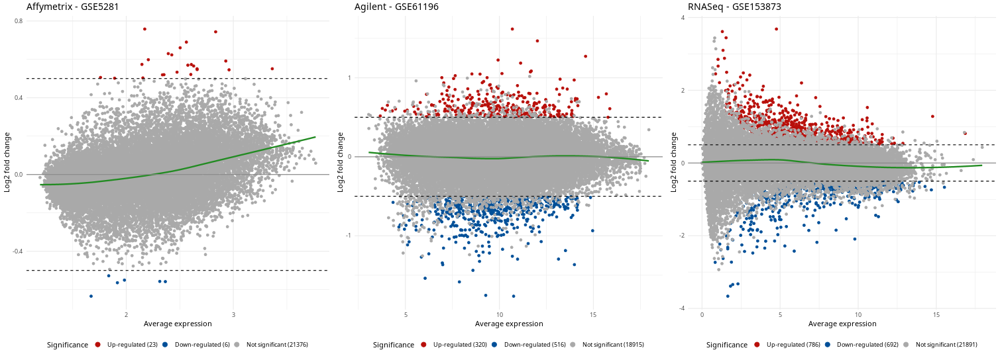

A normal MA plot will have most of the points centered around the zero log fold change line,
If all points are shifted up or down, it indicates a systematic bias in the data that needs to be corrected. The obtained plots are:

Similarly, we can have volcano plot for the three datasets, as well:

```{r, eval=FALSE}
# Volcano plots
p1 <- RCPA::plotVolcanoDE(rowData(affyDEExperiment), logFCThreshold = 0.5) + ggplot2::ggtitle("Affymetrix - GSE5281")
p2 <- RCPA::plotVolcanoDE(rowData(agilDEExperiment), logFCThreshold = 0.5) + ggplot2::ggtitle("Agilent - GSE61196")
p3 <- RCPA::plotVolcanoDE(rowData(RNASeqDEExperiment), logFCThreshold = 0.5) + ggplot2::ggtitle("RNASeq - GSE153873")

grid.arrange(p1, p2, p3, ncol = 3)
```

A normal volcano plot will have points that are relatively symmetrical around the y-axis of zero log fold change. The generated plots are:

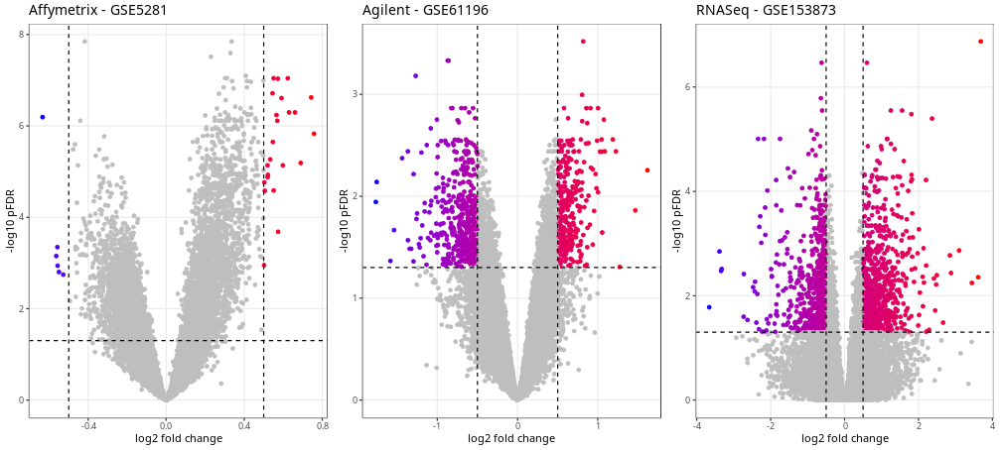

It is also important to check the intersection of DE genes between different datasets. This will help to identify potential issues in the analysis design. To this aim, we can use the function *plotVennDE* to generate the Venn diagram of DE genes among datasets as follows:

```{r, eval=FALSE}
# All DE genes
DEResults <- list(
"Affymetrix - GSE5281" = rowData(affyDEExperiment),
"Agilent - GSE61196" = rowData(agilDEExperiment),
"RNASeq - GSE153873" = rowData(RNASeqDEExperiment)
)
# Up-regulated genes
DEResultUps <- lapply(DEResults, function(df) df[!is.na(df$logFC) & df$logFC > 0,])
# Down-regulated genes
DEResultDowns <- lapply(DEResults, function(df) df[!is.na(df$logFC) & df$logFC < 0,])

p1 <- RCPA::plotVennDE(DEResults) + ggplot2::ggtitle("All DE Genes")
p2 <- RCPA::plotVennDE(DEResultUps) + ggplot2::ggtitle("Up-regulated DE Genes")
p3 <- RCPA::plotVennDE(DEResultDowns) + ggplot2::ggtitle("Down-regulated DE Genes")

grid.arrange(p1, p2, p3, ncol = 3)
```

and the generated Venn diagrams are:

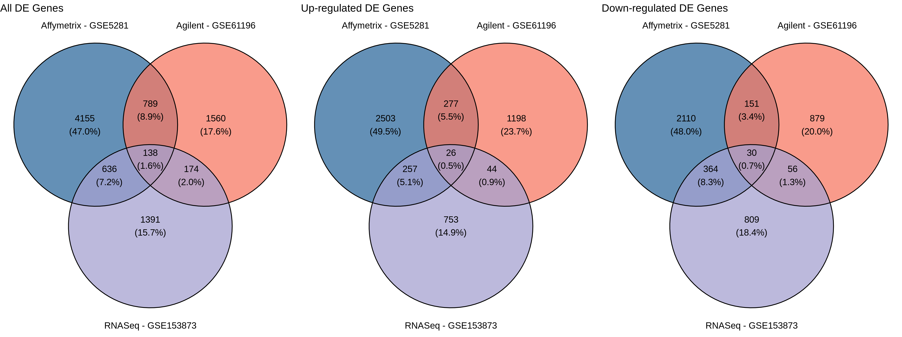

## Stage 3 : Pathway Analysis
In this pipeline, we have implemented eight widely used and reliable approaches for pathway analysis, which assist users in identifying significantly enriched functional categories.
We categorize these approaches into two subgroups: non-topology-based and topology-based pathway analysis tools.

### Non-Topology-Based Pathway Analysis
The included geneset enrichment analysis methods in RCPA package are *ORA*, *FGSEA*, *GSA*, *KS (Kolmogorov–Smirnov)*, and *Wilcox* tests, which do not account for gene interactions within a pathway.

To start with this analysis, beside the *SummarizedExperiment* object generated by differential analysis, users need to prepare genesets information beforehand.
In this protocol, we have implemented *getGeneSets* function to retrieve gene sets from two databases, including KEGG and GO, for a given organism. The below code retrieves genesets definitions from KEGG for human organism:

```{r, eval=FALSE}
genesets <- RCPA::getGeneSets(database = "KEGG", org = "hsa")

```

The returned object is a named list of length three, including, genesets definitions, names of genesets, and the size of genesets.

If users wish to use their own genesets in the analysis, they can prepare a geneset object with the same format as the returned object from *getGeneSets* function. We recommend using Entreze gene IDs as the gene identifiers in the genesets object, as we provided helper functions to retrieve the gene symbols and descriptions from the NCBI database, which will be used in the downstream analysis and visualization.

After preparing the genesets object, users can proceed to the enrichment analysis. The analysis can be initiated by calling the *runGeneSetAnalysis* function, which will execute the gene set analysis procedure based on the selected method.

To run the function with *fgsea* as method, for three datasets, the code is:

```{r, eval=FALSE}
#The list of additional arguments passed to fgsea function
fgseaArgsList <- list(minSize = 10, maxSize = Inf)

#Geneset enrichment analysis
affyFgseaResult <- runGeneSetAnalysis(affyDEExperiment, genesets, 
                                                method = "fgsea", FgseaArgs = fgseaArgsList)
agilFgseaResult <- runGeneSetAnalysis(agilDEExperiment, genesets, 
                                                method = "fgsea", FgseaArgs = fgseaArgsList)
RNASeqFgseaResult <- runGeneSetAnalysis(RNASeqDEExperiment, genesets, 
                                                  method = "fgsea", FgseaArgs = fgseaArgsList)
```

For *ORA* and *affyDEExperiment* object, we can use:

```{r, eval=FALSE}
affyORAResult <- runGeneSetAnalysis(affyDEExperiment, genesets, 
                                              method = "ora", ORAArgs = list(pThreshold = 0.05))

```

For *GSA* and *affyDEExperiment* object, we can use:

```{r, eval=FALSE}
affyGSAResult <- runGeneSetAnalysis(affyDEExperiment, genesets, method = "gsa")

```

For *KS* test and *affyDEExperiment* object, we can use:

```{r, eval=FALSE}
affyKSResult <- runGeneSetAnalysis(affyDEExperiment, genesets, method = "ks")

```

For *Wilcox* test and *affyDEExperiment* object, we can use:

```{r, eval=FALSE}
affyKSResult <- runGeneSetAnalysis(affyDEExperiment, genesets, method = "wilcox")

```

The output of the *runGeneSetAnalysis* function is a dataframe containing the results of the enrichment analysis. We can see a part of the output after running the function using *fgsea* method for *affyDEExperiment*:

```
head(affyFgseaResult)

             ID     p.value      score normalizedScore sampleSize                                     name       pFDR pathwaySize
1 path:hsa00010 0.960317460 -0.1543737      -0.7241513        161             Glycolysis / Gluconeogenesis 0.98074975          67
2 path:hsa00020 0.005245163 -0.4571873      -1.7675257        161                Citrate cycle (TCA cycle) 0.01874867          30
3 path:hsa00030 0.618226601 -0.2300682      -0.8894636        161                Pentose phosphate pathway 0.70793128          30
4 path:hsa00040 0.080103359 -0.3832427      -1.4148002        161 Pentose and glucuronate interconversions 0.15832193          35
5 path:hsa00051 0.069651741 -0.3671948      -1.4664612        161          Fructose and mannose metabolism 0.14446287          33
6 path:hsa00052 0.226600985  0.3270249       1.1911552        161                     Galactose metabolism 0.34608150          31
```

### Topology-Based Pathway Analysis
The methods for pathway enrichment analysis in RCPA are *SPIA*, *CePa ORA*, and *CePa GSA*, which consider the topology and interconnections between genes within a pathway. We have implemented the *runPathwayAnalysis* function to perform pathway enrichment analysis using one of the mentioned methods.

For each of these methods, we need to pass a network object which contains the pathways network information from the *KEGG* database. To elaborate, the *getSPIAKEGGNetwork* function generates the necessary network for *SPIA*,
while the *getCePaPathwayCatalogue* function produces the pathway catalog object required by both *CePa ORA* and *CePa GSA*.

We start with the process of running *SPIA*. First, we call the *getSPIAKEGGNetwork* to get network for human organism:

```{r, eval=FALSE}
spiaNetwork <- RCPA::getSPIAKEGGNetwork(org = "hsa", updateCache = FALSE)

```

The generated network object is a list of length three which are network definitions of pathways, names of patwhays, and the size of pathways.

Now, we can call *runPathwayAnalysis* function:

```{r, eval=FALSE}
affySpiaResult <- runPathwayAnalysis(affyDEExperiment, spiaNetwork, method = "spia")
agilSpiaResult <- runPathwayAnalysis(agilDEExperiment, spiaNetwork, method = "spia")
RNASeqSpiaResult <- runPathwayAnalysis(RNASeqDEExperiment, spiaNetwork, method = "spia")

```

To run any of the *CePa ORA*, or *CePa GSA*, we need first get the pathway network using *getCePaPathwayCatalogue* function, as:

```{r, eval=FALSE}
cepaNetwork <- RCPA::getCePaPathwayCatalogue(org = "hsa", updateCache = FALSE)

```

Similar to *getSPIAKEGGNetwork*, the generated network catalogue is a list of length three with the same structure.

Then, we can utilize the generated network to call *runPathwayAnalysis* function. To call the function using *affyDEExperiment* object and with *CePa ORA* as method:

```{r, eval=FALSE}
affyCepaORAResult <- runPathwayAnalysis(affyDEExperiment, cepaNetwork, method = "cepaORA")

```

and similarly, to call function using *affyDEExperiment* object and with *CePa GSA* as method:

```{r, eval=FALSE}
affyCepaGSAResult <- runPathwayAnalysis(affyDEExperiment, cepaNetwork, method = "cepaGSA")

```

The *runPathwayAnalysis* function returns a dataframe the same as the output of the *runGeneSetAnalysis* function. Below, the top rows of obtained results using *SPIA* and *affyDEExperiment* object is shown:

```
head(affySpiaResult)

             ID      p.value    score normalizedScore sampleSize                                      name         pFDR pathwaySize
1 path:hsa04510 9.788285e-12 309.3455        2.621572        161                            Focal adhesion 2.084905e-09         203
2 path:hsa01521 3.266474e-09 208.5036        3.861178        161 EGFR tyrosine kinase inhibitor resistance 3.478795e-07          79
3 path:hsa05205 1.400367e-08 238.6936        2.093804        161                   Proteoglycans in cancer 9.942605e-07         205
4 path:hsa05224 1.389835e-07 256.2247        3.371378        161                             Breast cancer 7.400873e-06         147
5 path:hsa05163 3.034553e-07 325.9313        3.017883        161           Human cytomegalovirus infection 1.292720e-05         225
6 path:hsa04015 4.707374e-07 266.1118        2.608939        161                    Rap1 signaling pathway 1.671118e-05         210
```

## Stage 4 : Integrative Analysis

### Gene-Level Meta Analysis
For gene-level meta-analysis, RCPA provides the function named *runDEMetaAnalysis* to perform meta-analysis using DE analysis results. Users can pick one of the *fisher*, *stouffer*, *addCLT*, *geoMean*, and *minP* methods to perform meta-analysis. Besides the p-values, the fold-changes also are combined using *SMD* method.
In the following code, we call this function utilizing three obtained DE
results from stage 2:
```{r, eval=FALSE}
#Preparing the input list of DE results
	DEResults <- list(
	"Affymetrix - GSE5281" = rowData(affyDEExperiment),
	"Agilent - GSE61196" = rowData(agilDEExperiment),
	"RNASeq - GSE153873" = rowData(RNASeqDEExperiment)
	)
	
	#Calling the runDEMetaAnalysis with 'stouffer' as the selected method to combine PValues
	metaDEResult <- RCPA::runDEMetaAnalysis(DEResults, method = "stouffer")
```

The output is a dataframe containing combined p-value, pFDR, log fold change, and log fold change standard error. In the below table, we show six top rows of the generated dataframe:
```
head(metaDEResult)

         ID     p.value       pFDR        logFC    logFCSE
1         1 0.174353595 0.29270763 -0.013705449 0.03476529
2        10 0.308032128 0.42645169 -0.007544587 0.04638417
3       100 0.046053297 0.11843678  0.109758840 0.04491284
4      1000 0.002159644 0.01397115  0.122360975 0.02258416
5     10000 0.248850476 0.37049220 -0.024867491 0.03560280
6 100009676 0.198906161 0.31976317  0.063481899 0.03587057
```
### Pathway-Level Meta Analysis
Users can perform meta-analysis of pathway analysis results,
using the *runPathwayMetaAnalysis* function. sers can pick one of the *fisher*, *stouffer*, *addCLT*, *geoMean*, and *minP* methods to perform meta-analysis. Besides the p-values, the scores also are combined using *SMD* method.
In the following code, we call this function utilizing three obtained enrichment analysis results of the FGSEA method in stage 3 to conduct meta-analysis based on *Stouffer's* method:

```{r, eval=FALSE}
	#Preparing the input list of enrichment results
	PAResults <- list(
	"Affymetrix - GSE5281" = affyFgseaResult,
	"Agilent - GSE61196" = agilFgseaResult,
	"RNASeq - GSE153873" = RNASeqFgseaResult
	)
	
	#Calling the runPathwayMetaAnalysis with 'stouffer' as the selected method to combine PValues
	metaPAResult <- RCPA::runPathwayMetaAnalysis(PAResults, method = "stouffer")
	
```

The output of meta-analysis is a dataframe containing combined p-value, score, and normalized score. In the below table, we show six top rows of the obtained results after performing meta-analysis:
```
head(metaPAResult)

             ID                                     name      p.value         pFDR      score normalizedScore pathwaySize
1 path:hsa00010             Glycolysis / Gluconeogenesis 2.135857e-01 0.2882539371 -1.1407845      -1.1407845          67
2 path:hsa00020                Citrate cycle (TCA cycle) 8.512241e-06 0.0001236105 -1.8765653      -1.8765653          30
3 path:hsa00030                Pentose phosphate pathway 7.180081e-03 0.0210954581 -2.0033607      -2.0033607          30
4 path:hsa00040 Pentose and glucuronate interconversions 3.866389e-02 0.0822846933 -1.2461496      -1.2461496          35
5 path:hsa00051          Fructose and mannose metabolism 7.692016e-02 0.1323186242 -0.7240442      -0.7240442          33
6 path:hsa00052                     Galactose metabolism 6.261533e-02 0.1154905018  1.1538696       1.1538696          31
```

### Pathway-Level Consensus Analysis
To start with consensus analysis, users can call the 
*runConsensusAnalysis* function with either *weightedZMean* or *RRA* to conduct consensus analysis. In the following code, we call *runConsensusAnalysis* to perform consensus analysis based on *weightedZMean* utilizing two obtained enrichment analysis results for *Affymetrix-GSE5281* dataset by *FGSEA*, and *SPIA* methods:

```{r, eval=FALSE}
	PAResults <- list(
	"fgsea" = affyFgseaResult,
	"spia" = affySpiaResult
	)
	
	consensusPAResult <- RCPA::runConsensusAnalysis(PAResults, method = "weightedZMean")

```

The output of *runConsensusAnalysis* function, is a dataframe containing combined p-value, and pFDR. In the below table, we show six top rows of the generated dataframe:
```
head(consensusPAResult)

             ID      p.value                                      name pathwaySize         pFDR
1 path:hsa01521 6.533630e-06 EGFR tyrosine kinase inhibitor resistance          79 6.533630e-06
2 path:hsa01522 2.329836e-04                      Endocrine resistance          98 2.329836e-04
3 path:hsa01523 2.123344e-01                     Antifolate resistance          30 2.123344e-01
4 path:hsa01524 2.524226e-01                  Platinum drug resistance          73 2.524226e-01
5 path:hsa03015 1.286289e-02                 mRNA surveillance pathway          97 1.286289e-02
6 path:hsa03018 2.324152e-02                           RNA degradation          79 2.324152e-02
```

## Stage 5 : Visualization
In this section, we demonstrate how to visualize the results of the pathway analysis and integrative analysis. RCPA includes several state-of-the-art plots, which can be used to visualize and interpret results more efficiently.
It is notable that since consensus analysis results do not report any score, the results can be visualized using plotting functions in RCPA that employ the p-value or pFDR. 

### Venn Diagram
We can plot the Venn diagram for enrichment analysis results using *plotVennPathway* function. The below code generates three Venn diagrams of all significant pathways, significant up-regulated pathways, and significant down-regulated pathways utilizing results obtained by *fgsea* method. The definition of up/down regulation depends on the method which we are using to analyze data. 

```{r, eval=FALSE}
PAResults <- list(
  	"Affymetrix - GSE5281" = affyFgseaResult,
  	"Agilent - GSE61196" = agilFgseaResult,
  	"RNASeq - GSE153873" = RNASeqFgseaResult,
  	"Meta-analysis" = metaPAResult
	)
	
	PAREsultUps <- lapply(PAResults, function(df) df[df$normalizedScore > 0,])
	PAREsultDowns <- lapply(PAResults, function(df) df[df$normalizedScore < 0,])
	
	p1 <- RCPA::plotVennPathway(PAResults, pThreshold = 0.05) + ggplot2::ggtitle("All Significant Pathways")
	p2 <- RCPA::plotVennPathway(PAREsultUps, pThreshold = 0.05) + ggplot2::ggtitle("Significantly Up-regulated Pathways")
	p3 <- RCPA::plotVennPathway(PAREsultDowns, pThreshold = 0.05) + ggplot2::ggtitle("Significantly Down-regulated Pathways")
	
	grid.arrange(p1, p2, p3, ncol = 3)
```

The generated Venn diagram is as: 

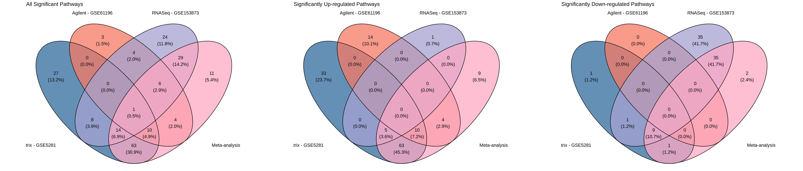

### Volcano Plot
Using the volcano plot, we can have a quick overview of the results of the enrichment analysis, as well as the general trend of the pathway regulation for each dataset.
The following code use the *plotVolcanoPathway* function from *RCPA* to plot four volcano plots, including 3 plots for the analysis of the 3 datasets and one for the meta-analysis, all using the FGSEA method.

```{r, eval=FALSE}
  p1 <- RCPA::plotVolcanoPathway(affyFgseaResult, sideToLabel = "left") + ggtitle("Affymetrix - GSE5281")
	p2 <- RCPA::plotVolcanoPathway(agilFgseaResult, sideToLabel = "left") + ggtitle("Agilent - GSE61196")
	p3 <- RCPA::plotVolcanoPathway(RNASeqFgseaResult, sideToLabel = "left") + ggtitle("RNASeq - GSE153873")
	p4 <- RCPA::plotVolcanoPathway(metaPAResult, sideToLabel = "left") + ggtitle("Meta-analysis")
	
	grid.arrange(p1, p2, p3, p4, ncol = 4)
```

The generated volcano plot is as: 

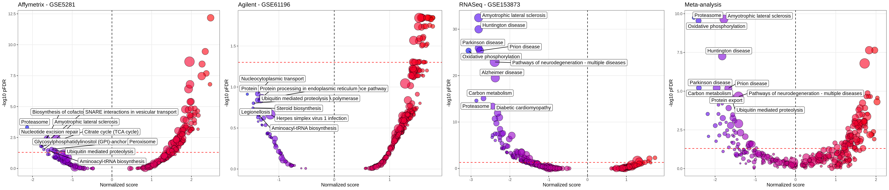

### Bar Chart
To plot the bar chart, users can use the *plotBarChart* function. In the following code, we plot the bar chart for the analysis of the FGSEA method using the 3 datasets along with the meta-analysis result. To limit the number of pathways to plot, we only plot the 17 pathways belonging to the categories *Neurodegenerative disease* and *Nervous system* of KEGG pathways.

```{r, eval=FALSE}
selectedPathways <- c("path:hsa05010", "path:hsa05012", "path:hsa05014", "path:hsa05016", "path:hsa05017", "path:hsa05020", "path:hsa05022", "path:hsa04724", "path:hsa04727", "path:hsa04725", "path:hsa04728", "path:hsa04726", "path:hsa04720", "path:hsa04730", "path:hsa04723", "path:hsa04721", "path:hsa04722")
	
	resultsToPlot <- lapply(PAResults, function(df) df[df$ID %in% selectedPathways,])
	
	RCPA::plotBarChart(resultsToPlot) + ggplot2::ggtitle("FGSEA Analysis Results")
```

The generated bar plot is as: 

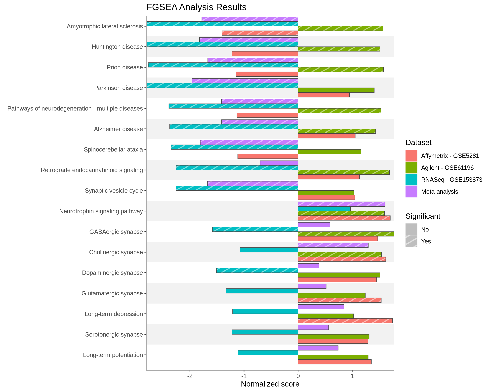

### Forest Plot
The forest plot displays the enrichment score along with their confidence interval as individual points along a horizontal line. When multiple datasets are analyzed, datasets are appended along the x-axis. The following code generates a forest plot using *plotForest* function, displaying the FGSEA analysis results for two categories *Neurodegenerative disease* and *Nervous system* of KEGG pathways on the selected three datasets:

```{r, eval=FALSE}
RCPA::plotForest(resultsToPlot, yAxis = "name", statLims = c(-3.5, 3.5))
```

The generated forest plot is as: 

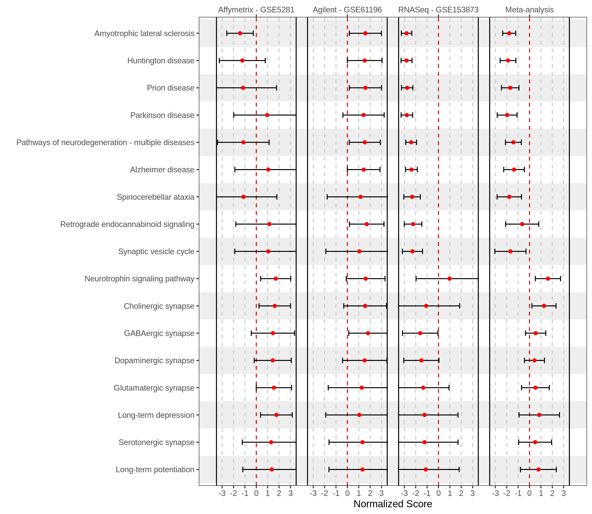

### Pathway Heatmap
The pathway heatmap shows three pieces of information for each pathway within each input study. These information are:
(i) the magnitude of the enrichment score,
(ii) the regulation direction, and
(iii) the significance of the enrichment score. 
In RCPA this plot can be generated using *plotPathwayHeatmap* function. The following code generates a pathway heatmap for KEGG pathways from two categories, *Neurodegenerative disease* and *Nervous system*,
using the resutls from the FGSEA method on the selected three datasets.

```{r, eval=FALSE}
RCPA::plotPathwayHeatmap(resultsToPlot, yAxis = "name")
```

The generated heatmap for pathways is as: 

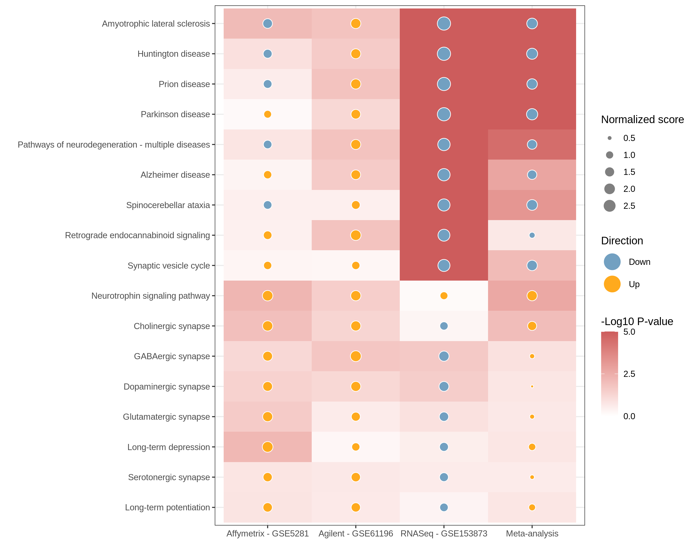

### Gene Heatmap
The gene heatmap shows log fold changes of the genes in the pathway along with their significance across different datasets. The following code plots the gene heatmap using *plotDEGeneHeatmap* in *RCPA* for top 50 genes in Alzheimer's disease pathway that are differentially expressed in meta-analysis.

```{r, eval=FALSE}
alzheimerGenes <- genesets$genesets[["path:hsa05010"]]
	genesToPlot <- head(metaDEResult[metaDEResult$ID %in% alzheimerGenes, ], 50)$ID
	
	genesAnnotation <- RCPA::getEntrezAnnotation(genesToPlot)
	labels <- genesAnnotation[genesToPlot, "Description"]
	
	genesOrderByFC <- order(metaDEResult[match(genesToPlot, metaDEResult$ID), "logFC"])
	resultsToPlot <- c(DEResults, list(metaDEResult))
	names(resultsToPlot) <- c(names(DEResults), "Meta-analysis")
	
	RCPA::plotDEGeneHeatmap(resultsToPlot, genesToPlot[genesOrderByFC],
	labels = labels[genesOrderByFC], negLog10pValueLims = c(0, 5), logFCLims = c(-1, 1)
	)
```

The generated heatmap for genes is as: 

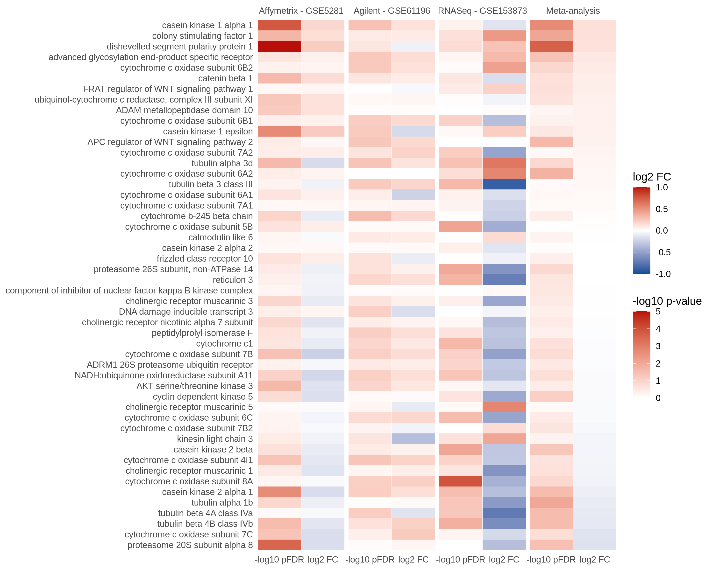

### KEGG Pathway Map
The KEGG pathway map shows the expression changes of the genes in the pathway on the KEGG pathway map. The following code plots the KEGG pathway map for Alzheimer's disease pathway by calling *plotKEGGMap* function implemented in RCPA.

```{r, eval=FALSE}
pltObj <- RCPA:::plotKEGGMap(DEResults, "hsa05010", stat = "logFC", pThreshold = 1, statLimit = 1)
pltObj$plot
```

The generated KEGG map for the selected pathway is as: 

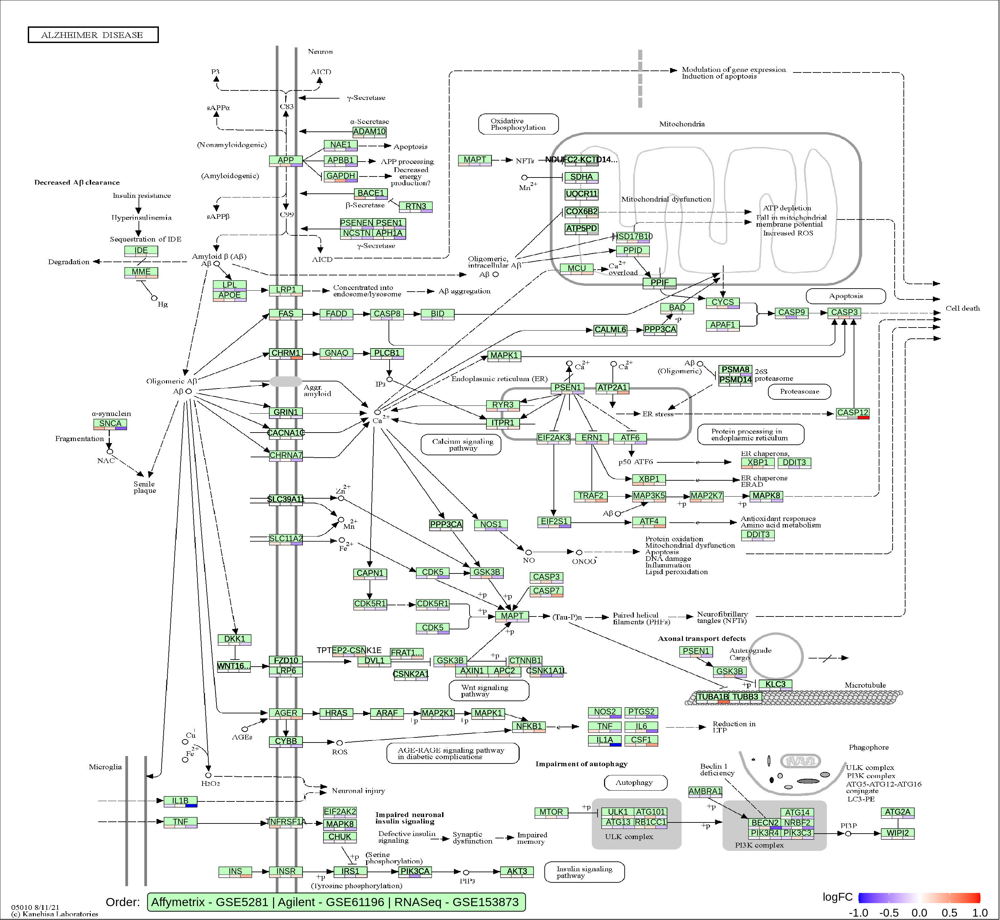

### Pathway Network
The pathway network shows each pathway as a node and the relationship (e.g., common genes) among the pathways as edges.
This plot is useful for understanding the relationships among the pathways and identifying the modules of related pathways that are impacted together. In the below code, we use the *plotPathwayNetwork* to generate the network plot of top 30 significantly enriched pathways in the meta-analysis result obtained in stage 4.

```{r, eval=FALSE}
genesetsToPlot <- metaPAResult$ID[order(metaPAResult$pFDR)][1:30]
	
	RCPA::plotPathwayNetwork(
	PAResults,
	genesets = genesets$genesets[genesetsToPlot],
	labels = genesets$names[genesetsToPlot],
	edgeThreshold = 0.75,
	mode = "continuous",
	statistic = "normalizedScore"
	)
	
	pltObj$plot()
```

The generated pathway network for the selected set of pathways is as: 

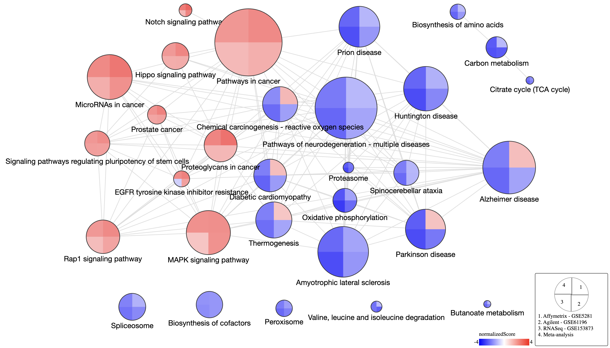

```
sessionInfo()
R version 4.1.3 (2022-03-10)
Platform: x86_64-conda-linux-gnu (64-bit)
Running under: Ubuntu 20.04.6 LTS

Matrix products: default
BLAS/LAPACK: /home/zmaghsoudi/miniconda3/envs/r4/lib/libopenblasp-r0.3.21.so

locale:
 [1] LC_CTYPE=en_US.UTF-8       LC_NUMERIC=C               LC_TIME=en_US.UTF-8        LC_COLLATE=en_US.UTF-8     LC_MONETARY=en_US.UTF-8    LC_MESSAGES=en_US.UTF-8   
 [7] LC_PAPER=en_US.UTF-8       LC_NAME=C                  LC_ADDRESS=C               LC_TELEPHONE=C             LC_MEASUREMENT=en_US.UTF-8 LC_IDENTIFICATION=C       

attached base packages:
[1] grid      stats4    stats     graphics  grDevices utils     datasets  methods   base     

other attached packages:
 [1] ggvenn_0.1.10               gridExtra_2.3               meta_6.2-1                  fgsea_1.20.0                hgu133plus2.db_3.13.0      
 [6] org.Hs.eg.db_3.14.0         AnnotationDbi_1.56.2        SummarizedExperiment_1.24.0 Biobase_2.54.0              GenomicRanges_1.46.1       
[11] GenomeInfoDb_1.30.1         IRanges_2.28.0              S4Vectors_0.32.4            BiocGenerics_0.40.0         MatrixGenerics_1.6.0       
[16] matrixStats_0.63.0          hgu133plus2cdf_2.18.0       RCPA_0.1.0                  testthat_3.1.7              ggplot2_3.4.2              
[21] dplyr_1.1.1                 tidyr_1.3.0                

loaded via a namespace (and not attached):
  [1] metadat_1.2-0          fastmatch_1.1-3        oligo_1.58.0           splines_4.1.3          BiocParallel_1.28.3    usethis_2.1.6          digest_0.6.31         
  [8] foreach_1.5.2          htmltools_0.5.5        fansi_1.0.4            magrittr_2.0.3         memoise_2.0.1          affyPLM_1.70.0         gcrma_2.66.0          
 [15] tzdb_0.3.0             limma_3.50.3           remotes_2.4.2          Biostrings_2.62.0      readr_2.1.4            annotate_1.72.0        R.utils_2.12.2        
 [22] prettyunits_1.1.1      colorspace_2.1-0       blob_1.2.4             ggrepel_0.9.3          callr_3.7.3            crayon_1.5.2           RCurl_1.98-1.12       
 [29] graph_1.72.0           genefilter_1.76.0      lme4_1.1-32            GEOquery_2.62.0        survival_3.5-5         iterators_1.0.14       glue_1.6.2            
 [36] gtable_0.3.3           zlibbioc_1.40.0        XVector_0.34.0         DelayedArray_0.20.0    pkgbuild_1.4.0         scales_1.2.1           DBI_1.1.3             
 [43] edgeR_3.36.0           miniUI_0.1.1.1         Rcpp_1.0.10            xtable_1.8-4           units_0.8-1            proxy_0.4-27           bit_4.0.5             
 [50] preprocessCore_1.56.0  profvis_0.3.7          htmlwidgets_1.6.2      httr_1.4.5             RColorBrewer_1.1-3     ellipsis_0.3.2         ff_4.0.9              
 [57] farver_2.1.1           urlchecker_1.0.1       pkgconfig_2.0.3        XML_3.99-0.14          R.methodsS3_1.8.2      locfit_1.5-9.7         utf8_1.2.3            
 [64] labeling_0.4.2         tidyselect_1.2.0       rlang_1.1.0            later_1.3.0            munsell_0.5.0          tools_4.1.3            cachem_1.0.7          
 [71] cli_3.6.1              generics_0.1.3         RSQLite_2.3.1          mathjaxr_1.6-0         devtools_2.4.5         stringr_1.5.0          fastmap_1.1.1         
 [78] processx_3.8.0         bit64_4.0.5            fs_1.6.1               oligoClasses_1.56.0    purrr_1.0.1            KEGGREST_1.34.0        nlme_3.1-162          
 [85] ggpattern_1.0.1        mime_0.12              R.oo_1.25.0            xml2_1.3.3             gridpattern_1.0.2      brio_1.1.3             compiler_4.1.3        
 [92] rstudioapi_0.14        curl_4.3.3             png_0.1-8              e1071_1.7-13           affyio_1.64.0          tibble_3.2.1           geneplotter_1.72.0    
 [99] stringi_1.7.12         ps_1.7.4               desc_1.4.2             lattice_0.21-8         Matrix_1.5-4           classInt_0.4-9         nloptr_2.0.3          
[106] vctrs_0.6.1            CompQuadForm_1.4.3     pillar_1.9.0           lifecycle_1.0.3        BiocManager_1.30.20    data.table_1.14.8      bitops_1.0-7          
[113] httpuv_1.6.9           R6_2.5.1               affy_1.72.0            promises_1.2.0.1       KernSmooth_2.23-20     affxparser_1.66.0      sessioninfo_1.2.2     
[120] codetools_0.2-19       boot_1.3-28.1          MASS_7.3-58.3          pkgload_1.3.2          DESeq2_1.34.0          rprojroot_2.0.3        withr_2.5.0           
[127] metafor_4.0-0          GenomeInfoDbData_1.2.7 parallel_4.1.3         hms_1.1.3              class_7.3-21           minqa_1.2.5            RobustRankAggreg_1.2.1
[134] ggnewscale_0.4.8       sf_1.0-12              numDeriv_2016.8-1.1    shiny_1.7.4           

```

