```{r, echo=FALSE}
knitr::opts_chunk$set(eval = FALSE)
```

## Introduction
RCPA is a software package designed for for Consensus Pathway Analysis (RCPA) that im- plements a complete analysis pipeline including: i) download and process data from NCBI Gene Expression Omnibus, ii) perform differential analysis using techniques developed for both microarray and sequencing data, iii) perform pathway analysis using different methods for enrichment analysis and topology-based (TB) analysis, iv) perform meta-analysis and combine methods and datasets to find consensus results, and v) visualize analysis results and ex- plore significantly impacted pathways across multiple analyses. The package supports the analysis of more than 1,000 species, three differential analysis techniques, eight pathway methods, and two pathway databases (GO and KEGG).

This vignette serves as an introductory guide to RCPA's essential usage and provides users with a solid understanding of its capabilities. Through practical case studies utilizing gene expression data sourced from NCBI GEO, we demonstrate the practical application of RCPA. By the end, users will have a clearer picture of the available functions, their relevance, and a starting point for seeking assistance as needed.

After installation, users can load the package as follows:

```{r, eval=FALSE}
unloadNamespace("RCPA")
library(RCPA)
library(SummarizedExperiment)
library(ggplot2)
library(gridExtra)
```

## Module 1: Data processing

### Processing Affymetrix and Agilent microarray data
RCPA provides the `downloadGEO` function for downloading, `processAffymetrix` and `processAgilent` for processing high-throughput gene expression data from NCBI GEO repository supporting both Affymetrix and Agilent technologies. Users then can save the processed data in a `SummarizedExperiment` object. The `SummarizedExperiment` object is structured in a way that captures the various dimensions and metadata associated with the data, making it an ideal choice for storing and manipulating complex datasets. The `assays` attribute of the resulted object contains gene expression values, and `colData` attribute stores sample-level metadata, such as clinical information, and experimental conditions.

#### Download and process *GSE5281* with *affymetrix* protocol:
In this example, we demonstrate the use of function `downloadGEO` for downloading an Affymetrix dataset from GEO database (accession ID: GSE5181). Users can run the following code to get the data:

```{r, eval=FALSE}
# User-defined directory to save the downloaded data
downloadPath <- file.path(getwd(), "GSE5281")
# Create the directory if it does not exist
if(!dir.exists(downloadPath)) dir.create(downloadPath)
# download the data
downloadedFiles <- RCPA::downloadGEO(GEOID = "GSE5281", platform = "GPL570", protocol = "affymetrix", destDir = downloadPath)
```

After executing the code, by running `head(downloadedFiles)` command to see the output. The function `downloadGEO` returns a list of downloaded files, which is assigned to the downloadedFiles variable. The first element of the list is the metadata file, and the remaining elements are the CEL files.

```
[1] "metadata.csv"     "GSM119615.CEL.gz" "GSM119616.CEL.gz" "GSM119617.CEL.gz"
[5] "GSM119618.CEL.gz" "GSM119619.CEL.gz"
```
We can then process the downloaded files as follow:

```{r, eval=FALSE}
# read the metadata file
affySampleInfo <- read.csv(file.path(downloadPath, "metadata.csv"))

# read the CEL files
affyExprs <- RCPA::processAffymetrix(dir = downloadPath, samples = affySampleInfo$geo_accession)

# create the SummarizedExperiment object
affyDataset <- SummarizedExperiment::SummarizedExperiment(assays = affyExprs, colData = affySampleInfo)
```

By running `head(affyDataset)` command, users can expect to get the below output:

```
class: SummarizedExperiment 
dim: 6 161 
metadata(0):
assays(1): ''
rownames(6): 1007_s_at 1053_at ... 1255_g_at 1294_at
rowData names(0):
colnames(161): GSM119615 GSM119616 ... GSM238955 GSM238963
colData names(70): title geo_accession ... sex.ch1 Sex.ch1
```

We can access to the assay data and the sample data stored in the `SummarizedExperiment` object using the functions from *SummarizedExperiment* namely `assay` and `colData`:

```{r, eval=FALSE}
# Access to assay data
affyExprs <- SummarizedExperiment::assay(affyDataset)
# Access to sample information
affySampleInfo <- SummarizedExperiment::colData(affyDataset)
```

After executing the above code, by running `head(affyExprs, c(5,6))` and `head(affySampleInfo, c(3, 10))` commands, users can expect to get the below outputs:

```
> head(affyExprs, c(5,6))
          GSM119615 GSM119616 GSM119617 GSM119618 GSM119619 GSM119620
1007_s_at  3.043234  3.055157  3.144277  3.150378  3.084336  2.989966
1053_at    1.698974  1.645050  1.618537  1.589216  1.676278  1.581733
117_at     1.795751  1.770719  1.805597  1.995794  1.688068  1.961556
121_at     2.553174  2.668456  2.801450  2.784216  2.588638  2.692849
1255_g_at  1.626691  1.940055  1.663162  1.483875  2.354096  1.671216

> head(affySampleInfo, c(3, 10))
DataFrame with 3 rows and 10 columns
                 title geo_accession                status submission_date last_update_date
           <character>   <character>           <character>     <character>      <character>
GSM119615 EC control 1     GSM119615 Public on Jul 10 2006     Jul 10 2006      Jun 26 2019
GSM119616 EC control 2     GSM119616 Public on Jul 10 2006     Jul 10 2006      Jun 26 2019
GSM119617 EC control 3     GSM119617 Public on Jul 10 2006     Jul 10 2006      Jun 26 2019
                 type channel_count        source_name_ch1 organism_ch1  characteristics_ch1
          <character>   <character>            <character>  <character>          <character>
GSM119615         RNA             1 brain, Entorhinal Co.. Homo sapiens Sample Amount: 10 ug
GSM119616         RNA             1 brain, Entorhinal Co.. Homo sapiens Sample Amount: 10 ug
GSM119617         RNA             1 brain, Entorhinal Co.. Homo sapiens Sample Amount: 10 ug
```

#### Download and process *GSE61196* with *agilent* technology:
In this example, we use the function `downloadGEO` to download an Agilent dataset from GEO database (accession ID: GSE61196):

```{r, eval=FALSE}
# User-defined directory to save the downloaded data
downloadPath <- file.path(getwd(), "GSE61196")
# Create the directory if it does not exist
if(!dir.exists(downloadPath)) dir.create(downloadPath)
# download the data
downloadedFiles <- RCPA::downloadGEO(GEOID = "GSE61196", platform = "GPL4133", protocol = "agilent", destDir = downloadPath)
```

In the above code, the function `downloadGEO` requires users to specify which color channel should be used when downloading an Agilent dataset. When `greenOnly = FALSE`, it tells the function that both red and green channels required. Similarly, we run `head(downloadedFiles)` command, and get the below output:

```
> head(downloadedFiles)
[1] "metadata.csv"      "GSM1499379.TXT.gz" "GSM1499380.TXT.gz"
[4] "GSM1499381.TXT.gz" "GSM1499382.TXT.gz" "GSM1499383.TXT.gz"
```

Next, we process the downloaded files as follows:

```{r, eval=FALSE}
# read the metadata file
agilSampleInfo <- read.csv(file.path(downloadPath, "metadata.csv"))

# read the TXT files
agilExprs <- processAgilent(dir = downloadPath, samples = agilSampleInfo$geo_accession, greenOnly = FALSE)

# create the SummarizedExperiment object
agilDataset <- SummarizedExperiment::SummarizedExperiment(assays = agilExprs, colData = agilSampleInfo)
```


We can then run the `print(agilDataset)` to display the `SummarizedExperiment` object:

```
class: SummarizedExperiment
dim: 6 21
metadata(0):
assays(1): ''
rownames(6): GE_BrightCorner DarkCorner ... DarkCorner DarkCorner
rowData names(0):
colnames(21): GSM1499379 GSM1499380 ... GSM1499398 GSM1499399
colData names(48): title geo_accession ... tissue.ch1 tissue.ch2
```

We can access to the assay data and the sample data stored in `agilDataset` variable as follows:

```{r, eval=FALSE}
# Access to assay data
agilExprs <- SummarizedExperiment::assay(agilDataset)
# Access to sample information
agilSampleInfo <- SummarizedExperiment::colData(agilDataset)
```


Next, we run `print(agilExprs[9:14, 1:6])` and `head(agilSampleInfo, c(3,10))` commands, and get the below outputs:

```
> print(agilExprs[9:14, 1:6])
             GSM1499379 GSM1499380 GSM1499381 GSM1499382 GSM1499383 GSM1499384
DarkCorner     4.663415   5.054929   5.113313   5.295257   5.424192   4.885411
DarkCorner     4.964227   5.219474   4.962025   5.199360   5.141188   5.020854
DarkCorner     4.898062   5.091960   4.909536   4.909536   5.424192   5.000929
A_24_P66027    8.090737   8.141476   8.163278   8.089728   8.128815   8.096007
A_32_P77178    5.329005   5.219474   5.551633   5.803849   5.725941   5.369755
A_23_P212522  11.178282  11.469014  11.354861  11.288909  11.435052  11.290439

> head(agilSampleInfo, c(3, 10))
DataFrame with 3 rows and 10 columns
                            title geo_accession                status submission_date
                      <character>   <character>           <character>     <character>
GSM1499379 human CPE Braak-0 do..    GSM1499379 Public on Dec 31 2014     Sep 08 2014
GSM1499380 human CPE Braak-0 do..    GSM1499380 Public on Dec 31 2014     Sep 08 2014
GSM1499381 human CPE Braak-0 do..    GSM1499381 Public on Dec 31 2014     Sep 08 2014
           last_update_date        type channel_count        source_name_ch1 organism_ch1
                <character> <character>   <character>            <character>  <character>
GSM1499379      Dec 31 2014         RNA             2 healthy human choroi.. Homo sapiens
GSM1499380      Dec 31 2014         RNA             2 healthy human choroi.. Homo sapiens
GSM1499381      Dec 31 2014         RNA             2 healthy human choroi.. Homo sapiens
              characteristics_ch1
                      <character>
GSM1499379 tissue: choroid plex..
GSM1499380 tissue: choroid plex..
GSM1499381 tissue: choroid plex..
```

### Download and process RNA-Seq read counts

One can also download read counts data from GEO and create the *SummarizedExperiment* object to be used in later stages. Here, we download read counts data for *GSE153873* from GEO:

```{r, eval=FALSE}
# Specify the GEO accession ID
GEOID <- "GSE153873"
# Create a download path
downloadPath <- getwd()
if(!dir.exists(downloadPath)) dir.create(downloadPath)
# Download the data
GEOquery::getGEOSuppFiles(GEOID, fetch_files = TRUE, baseDir = downloadPath)
```

Users can check the files in the download path using `list.files(downloadPath)` command and get the following result:

```
> list.files(downloadPath)
[1] "GSE153873" 
```

As we can see, when running the `GEOquery::getGEOSuppFiles()` function, it will automatically create a folder named *GSE153873* in the user-defined download folder and save all the downloaded data in that folder. We can see the files name in this newly-created folder by running `list.files(file.path(downloadPath, GEOID))` and get the following output:

```
> list.files(file.path(downloadPath, GEOID))
[1] "GSE153873_AD.vs.Old_diff.genes.xlsx" "GSE153873_summary_count.ercc.txt.gz"
[3] "GSE153873_summary_count.star.txt.gz"
```

Accordingly, the read count is saved under the name ``GSE153873_summary_count.star.txt.gz".
We can extract this file and obtain the assay data by running the following code snippet:

```{r, eval=FALSE}
# Specify the path to the downloaded read counts file
countsFile <- file.path(downloadPath, GEOID, "GSE153873_summary_count.star.txt.gz")
# Read the downloaded file
countsData <- read.table(countsFile, header = TRUE, sep = "\t", fill = 0, row.names = 1, check.names = FALSE)
```

By running `head(countsData, c(5,6))`, we can see some pieces of the data obtained, which is a dataframe in which rows are genes and columns are samples as follow:

```
> head(countsData, c(5,6))
       20-1T-AD 13-11T-Old 15-13T-Old 16-14T-Old 3-17T-Young 5-18T-Young
SGIP1      1405       1405       1169       2408         859        1164
NECAP2      295        460        334        347         617         585
AZIN2       356        306        385        507         787         751
AGBL4       191        200        173        323          36          89
CLIC4       876       1443        639        792        4806        5968
```

In addition to assay data, we also need to download the metadata for the samples. The function to download is `getGEO` from the *GEOquery* package. We have to specify the ID of the dataset that we want.

```{r, eval=FALSE}
# Download the GEO object to get metadata
GEOObject <- GEOquery::getGEO(GEOID, GSEMatrix = T, getGPL = T, destdir = downloadPath)
# Check the length of GEOObject
print(length(GEOObject))
# Extract the dataset from the GEOObject
samplesData <- GEOObject[[1]]
# Export sample data
metadata <- Biobase::pData(samplesData)
```

Some datasets on GEO may be derived from different microarray platforms. Therefore, the object `GEOObject` can be a list of different datasets. We can find out how many were used by checking the length of the `GEOObject` object. Usually there will only be one platform and the dataset we want to analyse will be the first object in the list (`GEOObject[[1]]`). Moreover, data submitted to GEO contain sample labels assigned by the experimenters, and some information about the processing protocol. All these data can be extracted by the `Biobase::pData()` function. By running `head(metadata, c(5,6))`, users can expect to see the following output:

```
> head(metadata, c(5,6))
                 title geo_accession                status submission_date last_update_date
GSM4656348  13-11T-Old    GSM4656348 Public on Jul 07 2020     Jul 06 2020      Oct 13 2020
GSM4656349  15-13T-Old    GSM4656349 Public on Jul 07 2020     Jul 06 2020      Oct 13 2020
GSM4656350    20-1T-AD    GSM4656350 Public on Jul 07 2020     Jul 06 2020      Oct 13 2020
GSM4656351  16-14T-Old    GSM4656351 Public on Jul 07 2020     Jul 06 2020      Oct 13 2020
GSM4656352 3-17T-Young    GSM4656352 Public on Jul 07 2020     Jul 06 2020      Oct 13 2020
           type
GSM4656348  SRA
GSM4656349  SRA
GSM4656350  SRA
GSM4656351  SRA
GSM4656352  SRA
```

As we can see, title column of metadata contains the value of the columns labels of countsData. To be consistent with other examples in which the sample IDs are in the standard GEO accession ID form (i.e., *GSMxxxx*), we will update the columns label of count data as follows:

```{r, eval=FALSE}
# Get the sample IDs in the GEO accession ID form
sampleIDs <- rownames(metadata)
# Get the sample titles
sampleTitles <- metadata[, "title"]
# Reorder the columns in the assay data
countsData <- countsData[,sampleTitles]
# Assign sample IDs to columns' labels
colnames(countsData) <- sampleIDs
```

By running `head(countsData, c(5,6))`, the new `countsData` is as follows:

```
> head(countsData, c(5,6))
       GSM4656348 GSM4656349 GSM4656350 GSM4656351 GSM4656352 GSM4656353
SGIP1        1405       1169       1405       2408        859       1164
NECAP2        460        334        295        347        617        585
AZIN2         306        385        356        507        787        751
AGBL4         200        173        191        323         36         89
CLIC4        1443        639        876        792       4806       5968
```

Finally, we can create the `SummarizedExperiment` to stored the assay and sample data as follows:

```{r, eval=FALSE}
# Create the SummarizedExperiment object
RNASeqDataset <- SummarizedExperiment::SummarizedExperiment(
  assays = as.matrix(countsData),
  colData = metadata
)
```

The summary of created RNASeq object after running `head(RNASeqDataset)` command can be explored, as:

```
class: SummarizedExperiment
dim: 6 30
metadata(0):
assays(1): ''
rownames(6): SGIP1 NECAP2 ... CLIC4 SLC45A1
rowData names(0):
colnames(30): GSM4656348 GSM4656349 ... GSM4656376 GSM4656377
colData names(38): title geo_accession ... disease state:ch1 tissue:ch1
```

Additionally, users can create their own `SummarizedExperiment` object from their customized data with the same procedure.

## Module 2 : Differential analysis

To begin with differential analysis (DE analysis), we can call *runDEAnalysis* function. This function utilizes one of the *limma*, *DESeq2*, and *edgeR* methods to perform the analysis. It is generally recommended to use *limma* for differential expression analysis of microarray data, or log-scaled RNA-seq data with TPM, FPKM, or RPKM normalization values. For RNA-seq data with raw counts, *DESeq2* or *edgeR* are recommended.

There are two important arguments in the function: *design* and *contrast*. The *design* matrix defines the statistical model to be fitted in the analysis. The *contrast* matrix defines the comparisons to be performed in the analysis.

### DE analysis using an Affymetrix dataset

To start, first, we add additional sample information to each of the *SummarizedExperiment* objects obtained from Stage 1. This completely depends on the experimental design and needs to be specified based on research question.
This information is used to define the design matrix for differential expression analysis. For *GSE5281* dataset, the samples have two conditions: normal and Alzheimer's, which are defined in the *characteristics\_ch1.8* column.
Each sample is also associated with a brain region, which is defined in the *characteristics\_ch1.4* column.

```{r, eval=FALSE}
# GSE5281
# Add a column specifying the condition of the sample, which can be either normal or alzheimer
affySampleInfo$condition <- ifelse(grepl("normal", affySampleInfo$characteristics_ch1.8), "normal", "alzheimer")
# Factorize the newly added column
affySampleInfo$condition <- factor(affySampleInfo$condition)
# Add the new column specify the region of the sample tissue
# and use make.names to remove special characters
affySampleInfo$region <- make.names(affySampleInfo$characteristics_ch1.4)
# Factorize the newly added column
affySampleInfo$region <- factor(affySampleInfo$region)
# Update the affyDataset object
SummarizedExperiment::colData(affyDataset) <- affySampleInfo
```

We can check whether the two new columns are added and saved in the `affyDataset` object by running the `head(affyDataset)` command line again:

```
class: SummarizedExperiment 
dim: 6 161 
metadata(0):
assays(1): ''
rownames(6): 1007_s_at 1053_at ... 1255_g_at 1294_at
rowData names(0):
colnames(161): GSM119615 GSM119616 ... GSM238955 GSM238963
colData names(72): title geo_accession ... condition region
```
As we can see, these two columns *condition* and *region* are added.
Next, we will create the *design* and *contrast* matrices for DE analysis.

```{r, eval=FALSE}
# GSE5281
# Create a design matrix
affyDesign <- model.matrix(~0 + condition + region + condition:region, data = SummarizedExperiment::colData(affyDataset))
# Avoid special characters in column names
colnames(affyDesign) <- make.names(colnames(affyDesign))
# Create a constrast matrix
affyContrast <- limma::makeContrasts(conditionalzheimer-conditionnormal, levels=affyDesign)
```

Here, the formula *~0 + condition + region + condition:region* defines the design matrix to include the main effects of condition and region, as well as the interaction between condition and region.
The term *~0* indicates that the intercept should not be included in the design matrix since the intercept is not of interest in the analysis. For more information on how to define the design matrix for different scenarios and interests, please refer to the limma user guide.
Next, we make use of the *limma::makeContrasts* function to define the contrast matrix. The formula *conditionalzheimer-conditionnormal* defines the contrast matrix to compare the alzheimer condition versus the normal condition.

An example of design matrix and contrast matrix is as follow:

```
> print(affyDesign[1:5, 1:3])
          conditionalzheimer conditionnormal regionorgan.region..hippocampus.
GSM119615                  0               1                                0
GSM119616                  0               1                                0
GSM119617                  0               1                                0
GSM119618                  0               1                                0
GSM119619                  0               1                                0
```

```
                                            Contrasts
Levels                                       conditionalzheimer - conditionnormal
  conditionalzheimer                                                            1
  conditionnormal                                                              -1
  regionorgan.region..hippocampus.                                              0
  regionorgan.region..medial.temporal.gyrus.                                    0
  regionorgan.region..posterior.cingulate.                                      0
  regionorgan.region..posterior.singulate.                                      0
```

Given the design matrix and contrast matrix, we can perform the differential analysis using limma for Affymetrix dataset as follow:

```{r, eval=FALSE}
# Run differential expression analysis
affyDEExperiment <- RCPA::runDEAnalysis(affyDataset, method = "limma", design = affyDesign, contrast = affyContrast, annotation = "GPL570")
```

We can check this variable by running `affyDEExperiment` in the console:

```
> affyDEExperiment
class: SummarizedExperiment 
dim: 21367 161 
metadata(4): DEAnalysis.method DEAnalysis.design DEAnalysis.contrast DEAnalysis.mapping
assays(1): counts
rownames(21367): 55101 92840 ... 9695 83887
rowData names(9): PROBEID ID ... sampleSize pFDR
colnames(161): GSM119615 GSM119616 ... GSM238955 GSM238963
colData names(72): title geo_accession ... condition region
```

The function *runDEAnalysis()* outputs a *SummarizedExperiment* object, and this new object extends the input *SummarizedExperiment* object to include the results of the differential analysis. In essence, the resulting object not only retains the expression data matrix and sample information but also incorporates the differential expression analysis results, which are stored under *rowData* attribute. As we can see in the R console, the new attribute *rowData* is added into the *SummarizedExperiment* object. Similar to the data stored under other attributes, this data can also be accessed using the function *rowData()* from the SummarizedExperiment package, as follows:

```{r, eval=FALSE}
# Extract the differential analysis result
affyDEResults <- SummarizedExperiment::rowData(affyDEExperiment)
```

Users can display the result in R console by running `head(affyDEResults, c(3,5))`:

```
> head(affyDEResults, c(3,5))
DataFrame with 3 rows and 5 columns
           PROBEID          ID     p.value statistic     logFC
       <character> <character>   <numeric> <numeric> <numeric>
55101     45828_at       55101 1.53869e-23  -11.8894 -0.465108
92840    226597_at       92840 3.56762e-23  -11.7546 -0.661995
727957   227778_at      727957 3.55473e-22  -11.3858 -0.525213
```


### DE analysis using an Agilent dataset

For *GSE61196* dataset, the samples have two conditions: normal and Alzheimer's, which are defined in the *source\_name\_ch1* column.

```{r, eval=FALSE}
# GSE61196
colData(agilDataset)$condition <- ifelse(grepl("healthy", colData(agilDataset)$source_name_ch1), "normal", "alzheimer")
colData(agilDataset)$condition <- factor(colData(agilDataset)$condition)
```

Next, we define the design matrix and contrast matrix for differential expression analysis. For this dataset, we define the design matrix to include the condition,
and similarly, the contrast matrix to compare the alzheimer condition versus the normal condition.

```{r, eval=FALSE}
# GSE61196
agilDesign <- model.matrix(~0 + condition, data = colData(agilDataset))
agilContrast <- limma::makeContrasts("conditionalzheimer-conditionnormal", levels=agilDesign)
```

As an example of expected output, here we show a part of constructed design and contrast matrices for *GSE61196*:

```
head(agilDesign)
           conditionalzheimer conditionnormal
GSM1499379                  0               1
GSM1499380                  0               1
GSM1499381                  0               1
GSM1499382                  0               1
GSM1499383                  0               1
GSM1499384                  0               1
```
```
head(agilContrast)
                    Contrasts
Levels               conditionalzheimer-conditionnormal
  conditionalzheimer                                  1
  conditionnormal                                    -1
```

Next, we define the mapping between the ID of the assay in the *SummarizedExperiment* object and Entrez ID.
The *annotation* argument can accept a supported GEO platform ID or a data frame with two columns: *FROM* and *TO*.
If a GEO platform ID is provided, the function will automatically download the available annotation from Bioconductor.
Users can use the function *RCPA::getSupportedPlatforms()* to get the list of supported GEO platform IDs.
For *GSE61196*, since the platform *GPL4133* is not supported by Bioconductor, we need to manually download the annotation from GEO as follows.

```{r, eval=FALSE}
# GSE61196
GPL4133Anno <- GEOquery::dataTable(GEOquery::getGEO("GPL4133"))@table
GPL4133GeneMapping <- data.frame(FROM = GPL4133Anno$SPOT_ID, TO = as.character(GPL4133Anno$GENE), stringsAsFactors = F)
GPL4133GeneMapping <- GPL4133GeneMapping[!is.na(GPL4133GeneMapping$TO), ]
```

The mapping output is a dataframe as:

```
head(GPL4133GeneMapping)

        FROM        TO
 A_24_P66027      9582
A_23_P212522     23200
A_24_P934473 100132006
  A_24_P9671      3301
A_24_P801451     10919
 A_32_P30710      9349
```

Finally, we perform differential expression analysis using the *runDEAnalysis* function.
We still use *limma* for differential expression analysis since the data are from microarray experiments.
```{r, eval=FALSE}
# GSE61196
agilDEExperiment <- RCPA::runDEAnalysis(agilDataset, method = "limma", design = agilDesign, contrast = agilContrast, annotation = GPL4133GeneMapping)
```

### DE analysis using an RNA-Seq dataset

For *GSE153873*, the samples have two conditions: normal and Alzheimer's, which are defined in the *characteristics\_ch1.1* column.

```{r, eval=FALSE}
# GSE153873
colData(RNASeqDataset)$condition <- ifelse(grepl("Alzheimer", colData(RNASeqDataset)$characteristics_ch1.1), "alzheimer", "normal")
```

Next, we define the design matrix and contrast matrix for differential expression analysis. For *GSE153873* dataset, we define the design matrix to include the condition,
and similarly, the contrast matrix to compare the alzheimer condition versus the normal condition.

```{r, eval=FALSE}
# GSE61196
agilDesign <- model.matrix(~0 + condition, data = colData(agilDataset))
agilContrast <- limma::makeContrasts("conditionalzheimer-conditionnormal", levels=agilDesign)

# GSE153873
RNASeqDesign <- model.matrix(~0 + condition, data = colData(RNASeqDataset))
RNASeqContrast <- limma::makeContrasts("conditionalzheimer-conditionnormal", levels=RNASeqDesign)
```

For *GSE153873*, the IDs are Gene SYMBOL, we can use the *org.Hs.eg.db* package to map Human Gene SYMBOL to Entrez ID as follows:

```{r, eval=FALSE}
# GSE153873
if (!require("org.Hs.eg.db", quietly = TRUE)) {
    BiocManager::install("org.Hs.eg.db")
}

library(org.Hs.eg.db)
ENSEMBLMapping <- AnnotationDbi::select(org.Hs.eg.db, keys = rownames(RNASeqDataset), columns = c("SYMBOL", "ENTREZID"), keytype = "SYMBOL")
colnames(ENSEMBLMapping) <- c("FROM", "TO")
```

The first rows of generated mapping dataframe are as:

```
head(ENSEMBLMapping)

   FROM     TO
  SGIP1  84251
 NECAP2  55707
  AZIN2 113451
  AGBL4  84871
  CLIC4  25932
SLC45A1  50651
```

Finally, we perform differential expression analysis using the *runDEAnalysis* function.
 For *GSE153873* dataset, we use *DESeq2* for differential expression analysis since the data are counts data from RNA-Seq experiments.

```{r, eval=FALSE}
# GSE153873
RNASeqDEExperiment <- RCPA::runDEAnalysis(RNASeqDataset, method = "DESeq2", design = RNASeqDesign, contrast = RNASeqContrast, annotation = ENSEMBLMapping)
```

User can also use *edgeR* for *GSE153873* dataset by setting the *method* argument to *edgeR*:

```{r, eval=FALSE}
# GSE153873
RNASeqDEExperiment <- RCPA::runDEAnalysis(RNASeqDataset, method = "edgeR", design = RNASeqDesign, contrast = RNASeqContrast, annotation = ENSEMBLMapping)
```

### Quality Control of DE Analysis Results
It is important to examine the differential analysis results before further analysis. This will help to identify potential issues in the analysis as well as to determine the suitable downstream analysis methods and parameters. Two common approaches are MA plot and volcano plot.

We have implemented three functions, *plotMA*, *plotVolcano*, and *plotVennDE*. Each of the mentioned functions returns a *ggplot* object that can be further customized using the *ggplot2* package.

The code below shows how to generate the MA plots for three datasets:

```{r, eval=FALSE}
# MA plots
p1 <- RCPA::plotMA(rowData(affyDEExperiment), logFCThreshold = 0.5) + ggplot2::ggtitle("Affymetrix - GSE5281")
p2 <- RCPA::plotMA(rowData(agilDEExperiment), logFCThreshold = 0.5) + ggplot2::ggtitle("Agilent - GSE61196")
p3 <- RCPA::plotMA(rowData(RNASeqDEExperiment), logFCThreshold = 0.5) + ggplot2::ggtitle("RNASeq - GSE153873")

gridExtra::grid.arrange(p1, p2, p3, ncol = 3)
```

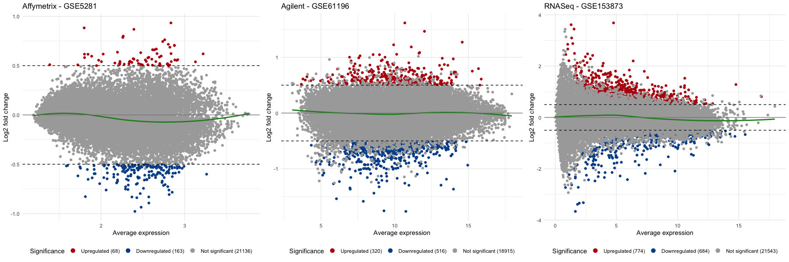

A normal MA plot will have most of the points centered around the zero log fold change line,
If all points are shifted up or down, it indicates a systematic bias in the data that needs to be corrected. The obtained plots are:

Similarly, we can have volcano plot for the three datasets, as well:

```{r, eval=FALSE}
# Volcano plots
p1 <- RCPA::plotVolcanoDE(rowData(affyDEExperiment), logFCThreshold = 0.5) + ggplot2::ggtitle("Affymetrix - GSE5281")
p2 <- RCPA::plotVolcanoDE(rowData(agilDEExperiment), logFCThreshold = 0.5) + ggplot2::ggtitle("Agilent - GSE61196")
p3 <- RCPA::plotVolcanoDE(rowData(RNASeqDEExperiment), logFCThreshold = 0.5) + ggplot2::ggtitle("RNASeq - GSE153873")

gridExtra::grid.arrange(p1, p2, p3, ncol = 3)
```

A normal volcano plot will have points that are relatively symmetrical around the y-axis of zero log fold change. The generated plots are:

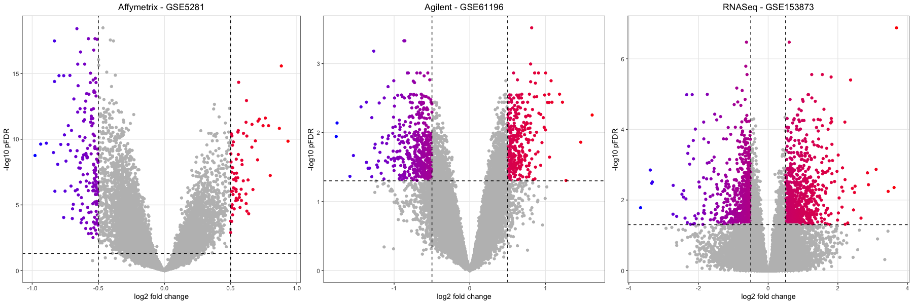

It is also important to check the intersection of DE genes between different datasets. This will help to identify potential issues in the analysis design. To this aim, we can use the function *plotVennDE* to generate the Venn diagram of DE genes among datasets as follows:

```{r, eval=FALSE}
# All DE genes
DEResults <- list(
"Affymetrix - GSE5281" = rowData(affyDEExperiment),
"Agilent - GSE61196" = rowData(agilDEExperiment),
"RNASeq - GSE153873" = rowData(RNASeqDEExperiment)
)
# Up-regulated genes
DEResultUps <- lapply(DEResults, function(df) df[!is.na(df$logFC) & df$logFC > 0,])
# Down-regulated genes
DEResultDowns <- lapply(DEResults, function(df) df[!is.na(df$logFC) & df$logFC < 0,])

p1 <- RCPA::plotVennDE(DEResults) + ggplot2::ggtitle("All DE Genes")
p2 <- RCPA::plotVennDE(DEResultUps) + ggplot2::ggtitle("Up-regulated DE Genes")
p3 <- RCPA::plotVennDE(DEResultDowns) + ggplot2::ggtitle("Down-regulated DE Genes")

gridExtra::grid.arrange(p1, p2, p3, ncol = 3)
```

and the generated Venn diagrams are:

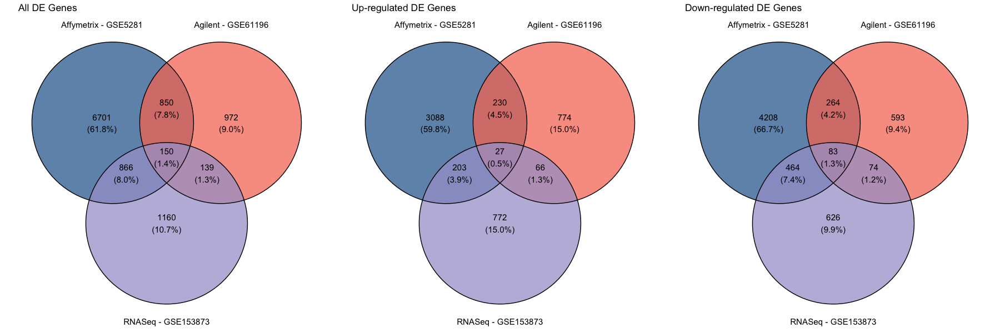

## Module 3 : System-level Analysis
In this pipeline, we have implemented eight widely used and reliable approaches for pathway analysis, which assist users in identifying significantly enriched functional categories.
We categorize these approaches into two subgroups: non-topology-based and topology-based pathway analysis tools.

### Non-Topology-Based Pathway Analysis
The included geneset enrichment analysis methods in RCPA package are *ORA*, *FGSEA*, *GSA*, *KS (Kolmogorov–Smirnov)*, and *Wilcox* tests, which do not account for gene interactions within a pathway.

To start with this analysis, beside the *SummarizedExperiment* object generated by differential analysis, users need to prepare genesets information beforehand.
In this protocol, we have implemented *getGeneSets* function to retrieve gene sets from two databases, including KEGG and GO, for a given organism. The below code retrieves genesets definitions from KEGG for human organism:

```{r, eval=FALSE}
genesets <- RCPA::getGeneSets(database = "KEGG", org = "hsa")
```

The returned object is a named list of length three, including, genesets definitions, names of genesets, and the size of genesets.

If users wish to use their own genesets in the analysis, they can prepare a geneset object with the same format as the returned object from *getGeneSets* function. We recommend using Entreze gene IDs as the gene identifiers in the genesets object, as we provided helper functions to retrieve the gene symbols and descriptions from the NCBI database, which will be used in the downstream analysis and visualization.

After preparing the genesets object, users can proceed to the enrichment analysis. The analysis can be initiated by calling the *runGeneSetAnalysis* function, which will execute the gene set analysis procedure based on the selected method.

To run the function with *fgsea* as method, for three datasets, the code is:

```{r, eval=FALSE}
#The list of additional arguments passed to fgsea function
fgseaArgsList <- list(minSize = 10, maxSize = Inf)

#Geneset enrichment analysis
affyFgseaResult <- runGeneSetAnalysis(affyDEExperiment, genesets,
                                                method = "fgsea", FgseaArgs = fgseaArgsList)
agilFgseaResult <- runGeneSetAnalysis(agilDEExperiment, genesets,
                                                method = "fgsea", FgseaArgs = fgseaArgsList)
RNASeqFgseaResult <- runGeneSetAnalysis(RNASeqDEExperiment, genesets,
                                                  method = "fgsea", FgseaArgs = fgseaArgsList)
```

For *ORA* and *affyDEExperiment* object, we can use:

```{r, eval=FALSE}
affyORAResult <- runGeneSetAnalysis(affyDEExperiment, genesets,
                                              method = "ora", ORAArgs = list(pThreshold = 0.05))

```

For *GSA* and *affyDEExperiment* object, we can use:

```{r, eval=FALSE}
affyGSAResult <- runGeneSetAnalysis(affyDEExperiment, genesets, method = "gsa")

```

For *KS* test and *affyDEExperiment* object, we can use:

```{r, eval=FALSE}
affyKSResult <- runGeneSetAnalysis(affyDEExperiment, genesets, method = "ks")

```

For *Wilcox* test and *affyDEExperiment* object, we can use:

```{r, eval=FALSE}
affyKSResult <- runGeneSetAnalysis(affyDEExperiment, genesets, method = "wilcox")

```

The output of the *runGeneSetAnalysis* function is a dataframe containing the results of the enrichment analysis. We can see a part of the output after running the function using *fgsea* method for *affyDEExperiment*:

```
> head(RNASeqFgseaResult)
             ID  p.value  score normalizedScore sampleSize                                              name
1 path:hsa05014 1.69e-35 -0.584           -2.78         30                     Amyotrophic lateral sclerosis
2 path:hsa05016 9.76e-33 -0.597           -2.78         30                                Huntington disease
3 path:hsa05012 2.84e-29 -0.607           -2.78         30                                 Parkinson disease
4 path:hsa05020 9.29e-29 -0.598           -2.74         30                                     Prion disease
5 path:hsa00190 8.11e-28 -0.743           -3.07         30                         Oxidative phosphorylation
6 path:hsa05022 3.86e-25 -0.487           -2.37         30 Pathways of neurodegeneration - multiple diseases
      pFDR pathwaySize
1 5.73e-33         364
2 1.65e-30         306
3 3.21e-27         266
4 7.87e-27         272
5 5.50e-26         134
6 2.18e-23         476
```

### Topology-Based Pathway Analysis
The methods for pathway enrichment analysis in RCPA are *SPIA*, *CePa ORA*, and *CePa GSA*, which consider the topology and interconnections between genes within a pathway. We have implemented the *runPathwayAnalysis* function to perform pathway enrichment analysis using one of the mentioned methods.

For each of these methods, we need to pass a network object which contains the pathways network information from the *KEGG* database. To elaborate, the *getSPIAKEGGNetwork* function generates the necessary network for *SPIA*,
while the *getCePaPathwayCatalogue* function produces the pathway catalog object required by both *CePa ORA* and *CePa GSA*.

We start with the process of running *SPIA*. First, we call the *getSPIAKEGGNetwork* to get network for human organism:

```{r, eval=FALSE}
spiaNetwork <- RCPA::getSPIAKEGGNetwork(org = "hsa", updateCache = FALSE)

```

The generated network object is a list of length three which are network definitions of pathways, names of patwhays, and the size of pathways.

Now, we can call *runPathwayAnalysis* function:

```{r, eval=FALSE}
affySpiaResult <- runPathwayAnalysis(affyDEExperiment, spiaNetwork, method = "spia")
agilSpiaResult <- runPathwayAnalysis(agilDEExperiment, spiaNetwork, method = "spia")
RNASeqSpiaResult <- runPathwayAnalysis(RNASeqDEExperiment, spiaNetwork, method = "spia")

```

To run any of the *CePa ORA*, or *CePa GSA*, we need first get the pathway network using *getCePaPathwayCatalogue* function, as:

```{r, eval=FALSE}
cepaNetwork <- RCPA::getCePaPathwayCatalogue(org = "hsa", updateCache = FALSE)

```

Similar to *getSPIAKEGGNetwork*, the generated network catalogue is a list of length three with the same structure.

Then, we can utilize the generated network to call *runPathwayAnalysis* function. To call the function using *affyDEExperiment* object and with *CePa ORA* as method:

```{r, eval=FALSE}
affyCepaORAResult <- runPathwayAnalysis(affyDEExperiment, cepaNetwork, method = "cepaORA")

```

and similarly, to call function using *affyDEExperiment* object and with *CePa GSA* as method:

```{r, eval=FALSE}
affyCepaGSAResult <- runPathwayAnalysis(affyDEExperiment, cepaNetwork, method = "cepaGSA")

```

The *runPathwayAnalysis* function returns a dataframe the same as the output of the *runGeneSetAnalysis* function. Below, the top rows of obtained results using *SPIA* and *affyDEExperiment* object is shown:

```
> head(RNASeqSpiaResult)
             ID      p.value     score normalizedScore sampleSize
1 path:hsa05016 1.836417e-28  33.48486      -1.3614702         30
2 path:hsa05014 8.015966e-27  68.44187      -1.0164137         30
3 path:hsa05020 1.771357e-24  43.61561      -1.0511215         30
4 path:hsa00190 2.024686e-24  46.89983       4.7167369         30
5 path:hsa05022 3.590430e-23 213.46961       0.7301322         30
6 path:hsa05010 5.217307e-23 130.11774      -0.5420581         30
                                               name         pFDR pathwaySize
1                                Huntington disease 5.215424e-26         306
2                     Amyotrophic lateral sclerosis 1.138267e-24         364
3                                     Prion disease 1.437527e-22         272
4                         Oxidative phosphorylation 1.437527e-22         134
5 Pathways of neurodegeneration - multiple diseases 2.039364e-21         476
6                                 Alzheimer disease 2.469525e-21         384
```

## Module 4 : Integrative Analysis and Visualization

### Gene-Level Meta Analysis
For gene-level meta-analysis, RCPA provides the function named *runDEMetaAnalysis* to perform meta-analysis using DE analysis results. Users can pick one of the *fisher*, *stouffer*, *addCLT*, *geoMean*, and *minP* methods to perform meta-analysis. Besides the p-values, the fold-changes also are combined using *SMD* method.
In the following code, we call this function utilizing three obtained DE
results from stage 2:
```{r, eval=FALSE}
#Preparing the input list of DE results
DEResults <- list(
	"Affymetrix - GSE5281" = rowData(affyDEExperiment),
	"Agilent - GSE61196" = rowData(agilDEExperiment),
	"RNASeq - GSE153873" = rowData(RNASeqDEExperiment)
	)

#Calling the runDEMetaAnalysis with 'stouffer' as the selected method to combine PValues
metaDEResult <- RCPA::runDEMetaAnalysis(DEResults, method = "stouffer")
```

The output is a dataframe containing combined p-value, pFDR, log fold change, and log fold change standard error. In the below table, we show six top rows of the generated dataframe:
```
> head(metaDEResult)
     ID      p.value         pFDR      logFC    logFCSE
1 84964 1.541734e-19 2.585333e-15 -0.4693914 0.04721164
2 10106 6.840827e-16 4.219658e-12  0.3273123 0.03915734
3  7108 8.988938e-16 4.219658e-12 -0.3681265 0.04798479
4  4713 1.006538e-15 4.219658e-12 -0.5306827 0.06044290
5 10382 1.766204e-15 5.923497e-12 -0.6648832 0.07334485
6   396 2.202702e-15 6.156186e-12 -0.3427080 0.03925764
```
### Pathway-Level Meta Analysis
Users can perform meta-analysis of pathway analysis results,
using the *runPathwayMetaAnalysis* function. sers can pick one of the *fisher*, *stouffer*, *addCLT*, *geoMean*, and *minP* methods to perform meta-analysis. Besides the p-values, the scores also are combined using *SMD* method.
In the following code, we call this function utilizing three obtained enrichment analysis results of the FGSEA method in stage 3 to conduct meta-analysis based on *Stouffer's* method:

```{r, eval=FALSE}
	#Preparing the input list of enrichment results
	PAResults <- list(
	"Affymetrix - GSE5281" = affyFgseaResult,
	"Agilent - GSE61196" = agilFgseaResult,
	"RNASeq - GSE153873" = RNASeqFgseaResult
	)

	#Calling the runPathwayMetaAnalysis with 'stouffer' as the selected method to combine PValues
	metaPAResult <- RCPA::runPathwayMetaAnalysis(PAResults, method = "stouffer")

```

The output of meta-analysis is a dataframe containing combined p-value, score, and normalized score. In the below table, we show six top rows of the obtained results after performing meta-analysis:
```
             ID                                              name      p.value         pFDR     score
1 path:hsa05012                                 Parkinson disease 7.123092e-46 2.393359e-43 -2.467830
2 path:hsa05016                                Huntington disease 3.763897e-44 6.323347e-42 -2.430244
3 path:hsa05014                     Amyotrophic lateral sclerosis 9.552510e-44 1.069881e-41 -2.393301
4 path:hsa00190                         Oxidative phosphorylation 6.473335e-40 5.437601e-38 -2.691299
5 path:hsa05020                                     Prion disease 1.291475e-37 8.678712e-36 -2.402497
6 path:hsa05022 Pathways of neurodegeneration - multiple diseases 9.036272e-34 5.060312e-32 -2.119561
  normalizedScore pathwaySize
1       -2.467830         266
2       -2.430244         306
3       -2.393301         364
4       -2.691299         134
5       -2.402497         272
6       -2.119561         476
```

### Pathway-Level Consensus Analysis
To start with consensus analysis, users can call the
*runConsensusAnalysis* function with either *weightedZMean* or *RRA* to conduct consensus analysis. In the following code, we call *runConsensusAnalysis* to perform consensus analysis based on *weightedZMean* utilizing two obtained enrichment analysis results for *Affymetrix-GSE5281* dataset by *FGSEA*, and *SPIA* methods:

```{r, eval=FALSE}
	PAResults <- list(
	"fgsea" = affyFgseaResult,
	"spia" = affySpiaResult
	)

	consensusPAResult <- RCPA::runConsensusAnalysis(PAResults, method = "weightedZMean")

```

The output of *runConsensusAnalysis* function, is a dataframe containing combined p-value, and pFDR. In the below table, we show six top rows of the generated dataframe:
```
> head(consensusPAResult)
             ID      p.value                                              name pathwaySize         pFDR
1 path:hsa05022 8.213205e-09 Pathways of neurodegeneration - multiple diseases         476 8.213205e-09
2 path:hsa05014 7.783738e-07                     Amyotrophic lateral sclerosis         364 7.783738e-07
3 path:hsa05016 1.933887e-06                                Huntington disease         306 1.933887e-06
4 path:hsa05020 3.727841e-06                                     Prion disease         272 3.727841e-06
5 path:hsa04723 7.422680e-06              Retrograde endocannabinoid signaling         148 7.422680e-06
6 path:hsa00190 7.736429e-06                         Oxidative phosphorylation         134 7.736429e-06
```

## Stage 5 : Visualization
In this section, we demonstrate how to visualize the results of the pathway analysis and integrative analysis. RCPA includes several state-of-the-art plots, which can be used to visualize and interpret results more efficiently.
It is notable that since consensus analysis results do not report any score, the results can be visualized using plotting functions in RCPA that employ the p-value or pFDR.

### Venn Diagram
We can plot the Venn diagram for enrichment analysis results using *plotVennPathway* function. The below code generates three Venn diagrams of all significant pathways, significant up-regulated pathways, and significant down-regulated pathways utilizing results obtained by *fgsea* method. The definition of up/down regulation depends on the method which we are using to analyze data.

```{r, eval=FALSE}
PAResults <- list(
  	"Affymetrix - GSE5281" = affyFgseaResult,
  	"Agilent - GSE61196" = agilFgseaResult,
  	"RNASeq - GSE153873" = RNASeqFgseaResult,
  	"Meta-analysis" = metaPAResult
	)

	PAREsultUps <- lapply(PAResults, function(df) df[df$normalizedScore > 0,])
	PAREsultDowns <- lapply(PAResults, function(df) df[df$normalizedScore < 0,])

	p1 <- RCPA::plotVennPathway(PAResults, pThreshold = 0.05) + ggplot2::ggtitle("All Significant Pathways")
	p2 <- RCPA::plotVennPathway(PAREsultUps, pThreshold = 0.05) + ggplot2::ggtitle("Significantly Up-regulated Pathways")
	p3 <- RCPA::plotVennPathway(PAREsultDowns, pThreshold = 0.05) + ggplot2::ggtitle("Significantly Down-regulated Pathways")

	gridExtra::grid.arrange(p1, p2, p3, ncol = 3)
```

The generated Venn diagram is as:

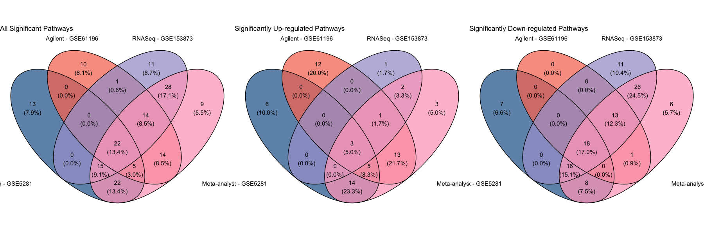

### Volcano Plot
Using the volcano plot, we can have a quick overview of the results of the enrichment analysis, as well as the general trend of the pathway regulation for each dataset.
The following code use the *plotVolcanoPathway* function from *RCPA* to plot four volcano plots, including 3 plots for the analysis of the 3 datasets and one for the meta-analysis, all using the FGSEA method.

```{r, eval=FALSE}
  p1 <- RCPA::plotVolcanoPathway(affyFgseaResult, sideToLabel = "left") + ggtitle("Affymetrix - GSE5281")
	p2 <- RCPA::plotVolcanoPathway(agilFgseaResult, sideToLabel = "left") + ggtitle("Agilent - GSE61196")
	p3 <- RCPA::plotVolcanoPathway(RNASeqFgseaResult, sideToLabel = "left") + ggtitle("RNASeq - GSE153873")
	p4 <- RCPA::plotVolcanoPathway(metaPAResult, sideToLabel = "left") + ggtitle("Meta-analysis")

	gridExtra::grid.arrange(p1, p2, p3, p4, ncol = 4)
```

The generated volcano plot is as:

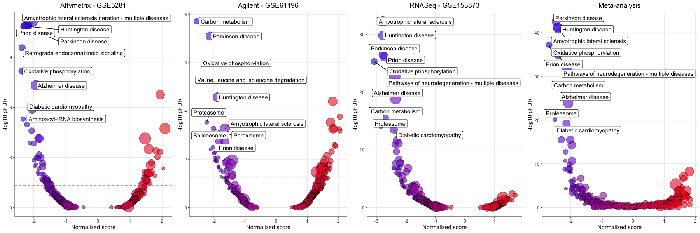

### Bar Chart
To plot the bar chart, users can use the *plotBarChart* function. In the following code, we plot the bar chart for the analysis of the FGSEA method using the 3 datasets along with the meta-analysis result. To limit the number of pathways to plot, we only plot the 17 pathways belonging to the categories *Neurodegenerative disease* and *Nervous system* of KEGG pathways.

```{r, eval=FALSE}
selectedPathways <- c("path:hsa05010", "path:hsa05012", "path:hsa05014", "path:hsa05016", "path:hsa05017", "path:hsa05020", "path:hsa05022", "path:hsa04724", "path:hsa04727", "path:hsa04725", "path:hsa04728", "path:hsa04726", "path:hsa04720", "path:hsa04730", "path:hsa04723", "path:hsa04721", "path:hsa04722")

	resultsToPlot <- lapply(PAResults, function(df) df[df$ID %in% selectedPathways,])

	RCPA::plotBarChart(resultsToPlot) + ggplot2::ggtitle("FGSEA Analysis Results")
```

The generated bar plot is as:

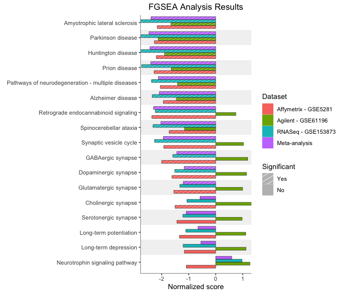

### Forest Plot
The forest plot displays the enrichment score along with their confidence interval as individual points along a horizontal line. When multiple datasets are analyzed, datasets are appended along the x-axis. The following code generates a forest plot using *plotForest* function, displaying the FGSEA analysis results for two categories *Neurodegenerative disease* and *Nervous system* of KEGG pathways on the selected three datasets:

```{r, eval=FALSE}
RCPA::plotForest(resultsToPlot, yAxis = "name", statLims = c(-3.5, 3.5))
```

The generated forest plot is as:

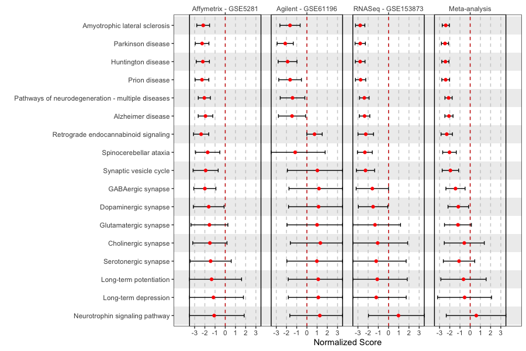

### Pathway Heatmap
The pathway heatmap shows three pieces of information for each pathway within each input study. These information are:
(i) the magnitude of the enrichment score,
(ii) the regulation direction, and
(iii) the significance of the enrichment score.
In RCPA this plot can be generated using *plotPathwayHeatmap* function. The following code generates a pathway heatmap for KEGG pathways from two categories, *Neurodegenerative disease* and *Nervous system*,
using the resutls from the FGSEA method on the selected three datasets.

```{r, eval=FALSE}
RCPA::plotPathwayHeatmap(resultsToPlot, yAxis = "name")
```

The generated heatmap for pathways is as:

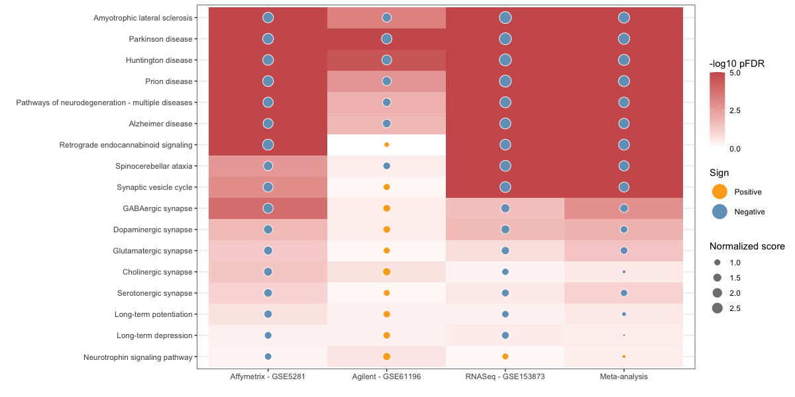

### Gene Heatmap
The gene heatmap shows log fold changes of the genes in the pathway along with their significance across different datasets. The following code plots the gene heatmap using *plotDEGeneHeatmap* in *RCPA* for top 50 genes in Alzheimer's disease pathway that are differentially expressed in meta-analysis.

```{r, eval=FALSE}
alzheimerGenes <- genesets$genesets[["path:hsa05010"]]
genesToPlot <- head(metaDEResult[metaDEResult$ID %in% alzheimerGenes, ], 50)$ID

genesAnnotation <- RCPA::getEntrezAnnotation(genesToPlot)
labels <- genesAnnotation[genesToPlot, "Description"]

genesOrderByFC <- order(metaDEResult[match(genesToPlot, metaDEResult$ID), "logFC"])
resultsToPlot <- c(DEResults, list(metaDEResult))
names(resultsToPlot) <- c(names(DEResults), "Meta-analysis")

RCPA::plotDEGeneHeatmap(resultsToPlot, genesToPlot[genesOrderByFC],
	labels = labels[genesOrderByFC], negLog10pValueLims = c(0, 5), logFCLims = c(-1, 1)
	)
```

The generated heatmap for genes is as:

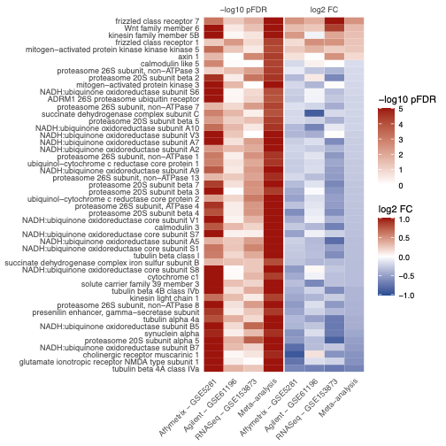

### KEGG Pathway Map
The KEGG pathway map shows the expression changes of the genes in the pathway on the KEGG pathway map. The following code plots the KEGG pathway map for Alzheimer's disease pathway by calling *plotKEGGMap* function implemented in RCPA.

```{r, eval=FALSE}
pltObj <- RCPA::plotKEGGMap(DEResults, "hsa05010", stat = "logFC", pThreshold = 1, statLimit = 1)
pltObj$plot
```

The generated KEGG map for the selected pathway is as:

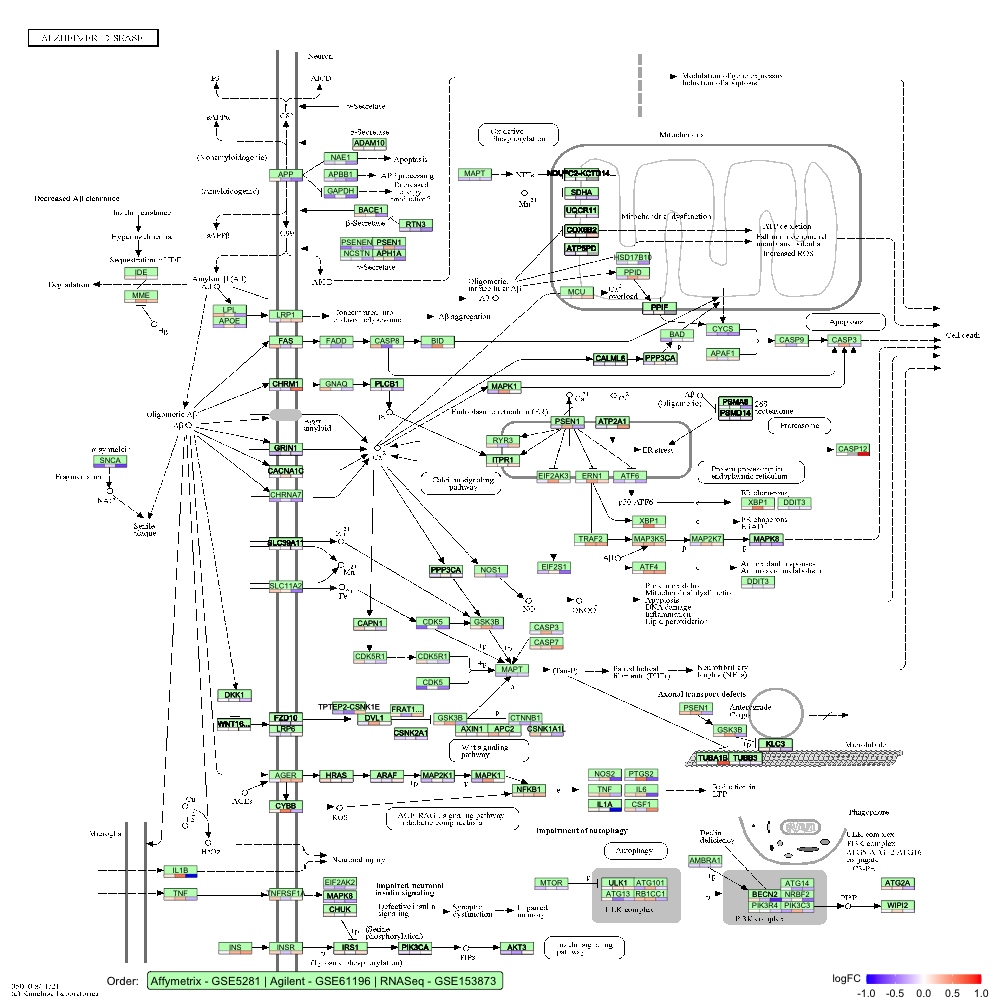

### Pathway Network
The pathway network shows each pathway as a node and the relationship (e.g., common genes) among the pathways as edges.
This plot is useful for understanding the relationships among the pathways and identifying the modules of related pathways that are impacted together. In the below code, we use the *plotPathwayNetwork* to generate the network plot of top 30 significantly enriched pathways in the meta-analysis result obtained in stage 4.

```{r, eval=FALSE}
genesetsToPlot <- metaPAResult$ID[order(metaPAResult$pFDR)][1:30]

pltHtml <- RCPA::plotPathwayNetwork(
	PAResults,
	genesets = genesets,
	selectedPathways = genesetsToPlot,
	edgeThreshold = 0.75,
	mode = "continuous",
	statistic = "normalizedScore"
	)
```

The generated pathway network for the selected set of pathways is as:

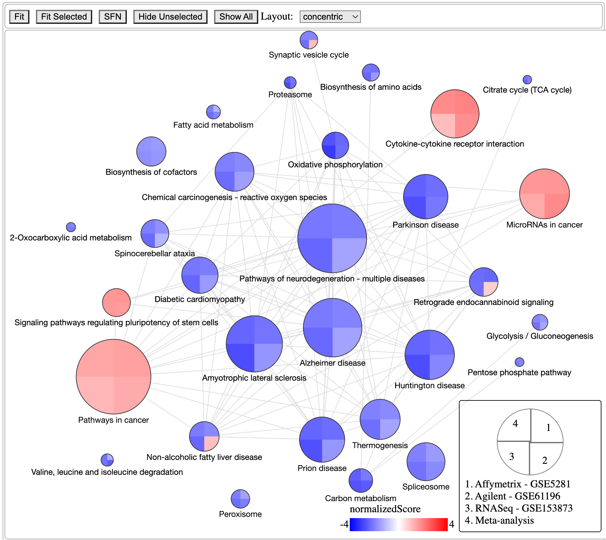

```
R version 4.3.1 (2023-06-16)
Platform: aarch64-apple-darwin23.0.0 (64-bit)
Running under: macOS Sonoma 14.0

Matrix products: default
BLAS:   /System/Library/Frameworks/Accelerate.framework/Versions/A/Frameworks/vecLib.framework/Versions/A/libBLAS.dylib 
LAPACK: /opt/homebrew/Cellar/r/4.3.1/lib/R/lib/libRlapack.dylib;  LAPACK version 3.11.0

locale:
[1] en_US.UTF-8/en_US.UTF-8/en_US.UTF-8/C/en_US.UTF-8/en_US.UTF-8

time zone: America/Chicago
tzcode source: internal

attached base packages:
[1] grid      stats4    stats     graphics  grDevices utils     datasets  methods   base     

other attached packages:
 [1] RCPA_0.2.1                  tidyr_1.3.0                 RCyjs_2.24.0               
 [4] BrowserViz_2.24.0           httpuv_1.6.12               jsonlite_1.8.7             
 [7] RCurl_1.98-1.12             png_0.1-8                   XML_3.99-0.15              
[10] gridExtra_2.3               ggvenn_0.1.10               dplyr_1.1.3                
[13] ggplot2_3.4.4               meta_6.5-0                  hgu133plus2.db_3.13.0      
[16] ROntoTools_2.30.0           Rgraphviz_2.46.0            KEGGgraph_1.62.0           
[19] KEGGREST_1.42.0             boot_1.3-28.1               graph_1.80.0               
[22] GSA_1.03.2                  fgsea_1.28.0                DESeq2_1.42.0              
[25] GenomicRanges_1.54.1        org.Hs.eg.db_3.18.0         AnnotationDbi_1.64.0       
[28] IRanges_2.36.0              Biobase_2.62.0              BiocGenerics_0.48.0        
[31] SummarizedExperiment_1.32.0 S4Vectors_0.40.1           

loaded via a namespace (and not attached):
  [1] mathjaxr_1.6-0          rstudioapi_0.15.0       magrittr_2.0.3          rmarkdown_2.25         
  [5] farver_2.1.1            nloptr_2.0.3            zlibbioc_1.48.0         vctrs_0.6.4            
  [9] gridpattern_1.1.1       memoise_2.0.1           minqa_1.2.6             base64enc_0.1-3        
 [13] CompQuadForm_1.4.3      htmltools_0.5.6.1       S4Arrays_1.2.0          curl_5.1.0             
 [17] SparseArray_1.2.0       KernSmooth_2.23-22      cachem_1.0.8            lifecycle_1.0.3        
 [21] pkgconfig_2.0.3         Matrix_1.6-1.1          R6_2.5.1                fastmap_1.1.1          
 [25] GenomeInfoDbData_1.2.11 RobustRankAggreg_1.2.1  MatrixGenerics_1.14.0   digest_0.6.33          
 [29] numDeriv_2016.8-1.1     colorspace_2.1-0        ggnewscale_0.4.9        RSQLite_2.3.2          
 [33] labeling_0.4.3          metadat_1.2-0           fansi_1.0.5             httr_1.4.7             
 [37] abind_1.4-5             compiler_4.3.1          proxy_0.4-27            bit64_4.0.5            
 [41] withr_2.5.2             metafor_4.4-0           BiocParallel_1.36.0     DBI_1.1.3              
 [45] R.utils_2.12.2          MASS_7.3-60             DelayedArray_0.28.0     classInt_0.4-10        
 [49] units_0.8-4             tools_4.3.1             R.oo_1.25.0             glue_1.6.2             
 [53] promises_1.2.1          nlme_3.1-163            sf_1.0-14               generics_0.1.3         
 [57] gtable_0.3.4            ggpattern_1.0.1         tzdb_0.4.0              class_7.3-22           
 [61] R.methodsS3_1.8.2       data.table_1.14.8       hms_1.1.3               xml2_1.3.5             
 [65] utf8_1.2.4              XVector_0.42.0          ggrepel_0.9.4           pillar_1.9.0           
 [69] stringr_1.5.0           limma_3.58.0            later_1.3.1             splines_4.3.1          
 [73] lattice_0.22-5          bit_4.0.5               GEOquery_2.70.0         tidyselect_1.2.0       
 [77] locfit_1.5-9.8          Biostrings_2.70.1       knitr_1.45              edgeR_4.0.1            
 [81] xfun_0.40               statmod_1.5.0           matrixStats_1.0.0       stringi_1.7.12         
 [85] yaml_2.3.7              evaluate_0.22           codetools_0.2-19        tibble_3.2.1           
 [89] BiocManager_1.30.22     cli_3.6.1               munsell_0.5.0           Rcpp_1.0.11            
 [93] GenomeInfoDb_1.38.0     parallel_4.3.1          readr_2.1.4             blob_1.2.4             
 [97] bitops_1.0-7            lme4_1.1-35.1           e1071_1.7-13            scales_1.2.1           
[101] purrr_1.0.2             crayon_1.5.2            rlang_1.1.1             cowplot_1.1.1          
[105] fastmatch_1.1-4 

```

